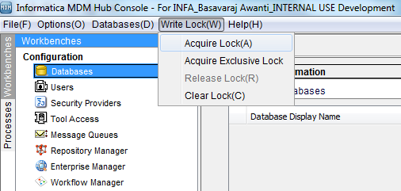
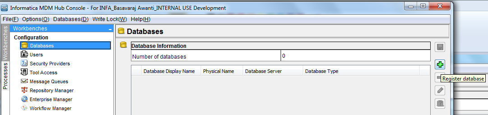
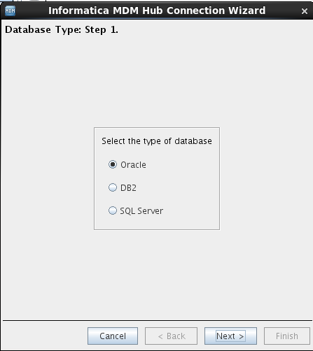
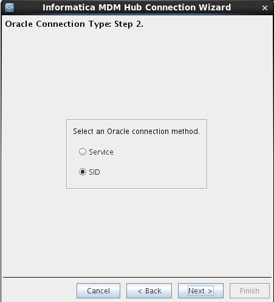
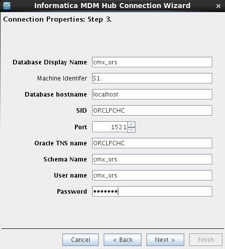
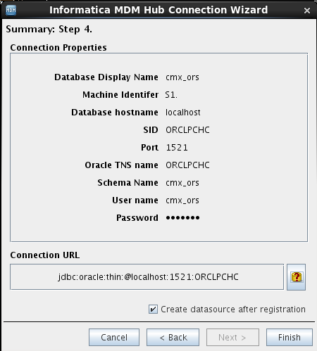
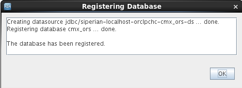
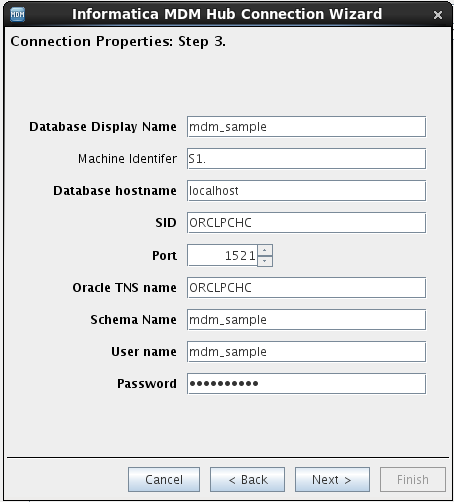
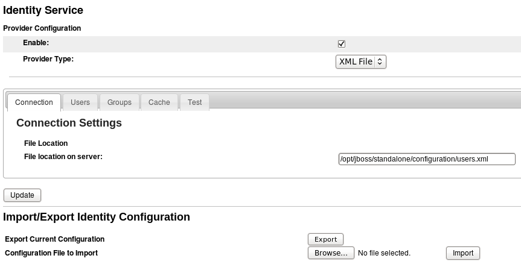

# Informatica IPS Integration Development Image

| Document Property |                       Value                       |
|-------------------|---------------------------------------------------|
| Author:           | [Jaroslav Brazda](mailto:jbrazda@informatica.com) |
| Release Date:     | November 2014                                     |

<!-- MarkdownTOC -->

- [Included Software](#included-software)
    - [Informatica Software](#informatica-software)
- [Installation steps](#installation-steps)
    - [Midnight Commander](#midnight-commander)
    - [Subversion](#subversion)
    - [Oracle Java JDK](#oracle-java-jdk)
    - [Informatica BPM (ActiveVOS) Build Framework](#informatica-bpm-activevos-build-framework)
    - [Install MDM Server](#install-mdm-server)
    - [Install ActiveVOS Server](#install-activevos-server)
    - [Configure Users and Roles](#configure-users-and-roles)
    - [Enable ActiveVOS Identity Service](#enable-activevos-identity-service)
    - [Configure URN Mappings](#configure-urn-mappings)

<!-- /MarkdownTOC -->


This image is based on the base Centos Image downloaded from
[Download](ftp://IPS-User!seal@ftp4.informatica.com/BASE_IMAGES/CENTOS_64/psvlxprof2-onlyOracle)

This image focuses on support for the complex integration scenarios that involve multiple products with focus on the Informatica BPM Integration scenarios

Additional configuration changes 
* Added user `infa` pasword `informatica!234`
    * Configured user to have access to the oracle client installed under `oracle`
    * `infa` user is set as sudoer
* Changed hostname to infadev.informatica.com
* Installed avahi deamon to enable apple multicast DNS discovery and ability resolve the vm host as infadev.local on the host machine
* oracle management console is accessible on
    * https://infadev.local:1158/em (works only from vmware host machine)
    * https://infadev.informatica.com:1158/em


## Included Software 
* Oracle 11g 64-bit release 11.2.0.4
* Oracle Java JDK 64-Bit Server VM (build 24.71-b01)
* Midnight Commander
* Subversion 1.6.11 (r934486)
* Sublime Text 3 Editor build 3065
*  

## Informatica Software
* Informatica BPM (ActiveVOS Server 9.2.4)
* Informatica MDM 9.7.1
* Informatica PIM 7.1
* Informatica Power Center 

User that runs all components is 

* User name: `infa`
* Password: `informatica!234`
* Default interactive shell: `zsh`

> Note: if you want to change default shell you can use `System Preferences/Users and groups` (requires root password)

All user environment variables are set in the `~/.profile`
```shell
ORACLE_HOME=/oracle/product/11.2.0/dbhome_2
ORACLE_HOSTNAME=infadev.informatica.com
PATH=$ORACLE_HOME/bin:$PATH
LD_LIBRARY_PATH=$ORACLE_HOME/lib:$LD_LIBRARY_PATH
ORACLE_SID=ORCLPCHC
NLS_LANG=AMERICAN_AMERICA.AL32UTF8
JAVA_HOME=/usr/java/jdk1.7.0_71
export ORACLE_HOME
export ORACLE_HOSTNAME
export ORACLE_SID
export NLS_LANG
export LD_LIBRARY_PATH
export PATH
export JAVA_HOME
```


# Installation steps

## Midnight Commander
Useful and efficient two pane file manager, just type mc in the shell to use it
```shell
sudo yum -y install mc
```

## Subversion
```shell
 sudo yum -y install subversion
```

## Oracle Java JDK
Download latest 64 bit Java rpm from http://www.oracle.com/technetwork/java/javase/downloads/index.html 

> Check this guide for additional details [Java install guide RHEL/Fedora/Centos](http://www.if-not-true-then-false.com/2010/install-sun-oracle-java-jdk-jre-7-on-fedora-centos-red-hat-rhel/)

```shell
sudo rpm -Uvh /path/to/binary/jdk-7u67-linux-x64.rpm
```

## Informatica BPM (ActiveVOS) Build Framework
One of the best practices to deliver ActiveVOS based solutions is to automate build and deployment procedures and enable projects for continuous integration and eliminate manual steps to build test and deploy an orchestration projects. 
This image contains example of such framework
This framework is using Apache Ant, Centos yum isntaller provides only quite outdated ant version 1.6.x we want to use something newer.

### Install Ant
```shell
cd ~/Downloads
curl -o http://archive.apache.org/dist/ant/binaries/apache-ant-1.9.4-bin.tar.gz
sudo mkdir -p /opt/java/ant
sudo tar xvfvz apache-ant-1.9.4-bin.tar.gz -C /opt/java/ant
sudo ln -s /opt/java/ant/apache-ant-1.9.4 /opt/ant
```
You then have to set up ANT_HOME environment variable, and include Ant binary in our path, as follows.
```shell
sudo sh -c 'echo ANT_HOME=/opt/ant >> /etc/environment'
sudo ln -s /opt/ant/bin/ant /usr/bin/ant
```

### Install Maven

```shell
cd ~/Downloads
curl -O http://apache.osuosl.org/maven/maven-3/3.0.5/binaries/apache-maven-3.0.5-bin.tar.gz
sudo mkdir -p /opt/java/maven 
sudo tar xvfvz apache-maven-3.0.5-bin.tar.gz -C /opt/java/maven
sudo ln -s /opt/java/maven/apache-maven-3.0.5 /opt/maven

sudo sh -c 'echo MAVEN_HOME=/opt/maven >> /etc/environment'
sudo ln -s /opt/maven/bin/mvn /usr/bin/mvn

```


### Checkout Build framework from the SVN  
```shell
svn co --username [your_user_name] http://aedev.informatica.com/AETechSvcs/trunk/CustomerProjects/BuildFramework/trunk
```

### Install JBOSS
We will install JBOSS EAP 6.2 as it  is supported both by MDM and ActiveVOS. We will use single app server instance to save some valuable HDD Space and RAM on this VM
It is not possible to download jboss without authentication jboss community portal so it is already downloaded in case wyou want to re-install jboss or install newer version you have to download it manually from http://www.jboss.org/products/eap/download/

> Note: we are using infa:infa user/group to be an owner of the jboss directory, typically this would be jboss user in real production environment. we are using single user to install all software to simplify management of this Development/Demo intended VM image.


```shell
cd ~/Downloads
sudo mkdir -p /opt/java/jboss 
sudo unzip jboss-eap-6.2.0.zip -d /opt/java/jboss
sudo chown -R infa:infa /opt/java/jboss
sudo ln -s /opt/java/jboss/jboss-eap-6.2 /opt/jboss
sudo chown -R infa:infa /opt/jboss
sudo sh -c 'echo JBOSS_HOME=/opt/jboss >> /etc/environment'
```


#### Configure JBOSS
For this installation we will use JBOSS in standalone mode and deploy all the MDM and ActiveVOS components to a single JVM

Before starting the JBoss server we need to add a user to access the JBoss console. 
We have used:
* Username: infa
* Password: informatica!234

Run following
```
cd /opt/jboss/bin
> $ ./add-user.sh
What type of user do you wish to add? 
 a) Management User (mgmt-users.properties) 
 b) Application User (application-users.properties)
(a):     

Enter the details of the new user to add.
Using realm 'ManagementRealm' as discovered from the existing property files.
Username : infa       
Password : 
Re-enter Password : 
What groups do you want this user to belong to? (Please enter a comma separated list, or leave blank for none)[  ]: abAdmin,abTaskClient
About to add user 'infa' for realm 'ManagementRealm'
Is this correct yes/no? yes
Added user 'infa' to file '/opt/java/jboss/jboss-eap-6.2/standalone/configuration/mgmt-users.properties'
Added user 'infa' to file '/opt/java/jboss/jboss-eap-6.2/domain/configuration/mgmt-users.properties'
Added user 'infa' with groups abAdmin,abTaskClient to file '/opt/java/jboss/jboss-eap-6.2/standalone/configuration/mgmt-groups.properties'
Added user 'infa' with groups abAdmin,abTaskClient to file '/opt/java/jboss/jboss-eap-6.2/domain/configuration/mgmt-groups.properties'
Is this new user going to be used for one AS process to connect to another AS process? 
e.g. for a slave host controller connecting to the master or for a Remoting connection for server to server EJB calls.
yes/no? yes
To represent the user add the following to the server-identities definition <secret value="aW5mb3JtYXRpY2EhMjM0" />

```

We also want to adjust  some startup parameters  namely JVM parameters
to do so edit the `/opt/jboss/bin/standalone.conf` file

Add following line to to the top of the file
```shell
## -*- shell-script -*- ######################################################
##                                                                          ##
##  JBoss Bootstrap Script Configuration                                    ##
##                                                                          ##
##############################################################################

JAVA_OPTS="$JAVA_OPTS -Xms2048m -Xmx2048m -XX:MaxPermSize=384m -Djava.net.preferIPv4Stack=true -Djava.awt.headless=true"
...
# remaining lines can stay unchanged
```


### MDM Hub required Changes

* Increase the transaction timeout to 3600 in the following file `/opt/jboss/standalone/configuration/standalone-full.xml`
* Disable HornetQ Security: Set hornetQ security to false as shown in the following example
```xml
<hornetq-server>
    <security-enabled>false</security-enabled>
    ...
</hornetq-server>
```
* Under `<subsystem xmlns="urn:jboss:domain:logging:1.3">` add the following XML code to configure asynchronous handling for the logger:
```xml
<async-handler name="ASYNC"> 
    <level name="INFO"/> 
    <queue-length value="1024"/> 
    <overflow-action value="BLOCK"/> 
    <subhandlers> 
        <handler name="FILE"/> 
        <handler name="CONSOLE"/> 
    </subhandlers> 
</async-handler>
```
*  Under `<subsystem xmlns="urn:jboss:domain:logging:1.3">` add the following XML code to configure asynchronous handling for the root logger
```xml
<root-logger>
    <level name="INFO"/> 
    <handlers> 
        <handler name="ASYNC"/> 
    </handlers> 
</root-logger>
```
* Disable remote connector security. Remove the security-realm attribute from the following code
```xml
<subsystem xmlns="urn:jboss:domain:remoting:1.1">
    <connector name="remoting-connector" socket-binding="remoting" security-realm="ApplicationRealm"/>
</subsystem>
```

## Install MDM Server
Install and Configure Oracle
Oracle is already pre-installed on this VM

### Create the directory for the MDM tablespace storage
```shell
su -l oracle
mkdir /oracle/oradata/mdm
```

### Prepare MDM Database
You can run following script or follow manually DB configuration steps below
```shell 
exit | sqlplus -S system/Ter4Lyte @/home/infa/workpace/mdm/create_database.sql
```
### Disable the Oracle Recycle Bin
Once database is installed, turn off the Oracle recycle bin. To turn the feature ON or OFF here what you have to do
```sql
ALTER SYSTEM SET recyclebin = OFF DEFERRED;
ALTER SYSTEM SET recyclebin = ON DEFERRED;
```

>NOTE:  DEFERRED is used because it takes effect in new sessions in the database

### Create Tablespaces
You must create the CMX_DATA, CMX_INDX, CMX_TEMP table spaces for the Hub Store
We have slitely altered the default tablespace sttings documented in the MDM installation guide to enable tible autoextend and start with smaler initial zize.

```sql
CREATE BIGFILE TABLESPACE CMX_DATA
NOLOGGING
DATAFILE '/oracle/oradata/mdm/CMX_DATA1.dbf' SIZE 1024M REUSE
autoextend on maxsize unlimited;

CREATE BIGFILE TABLESPACE CMX_INDX
NOLOGGING
DATAFILE '/oracle/oradata/mdm/CMX_INDX1.dbf' SIZE 1024M
autoextend on maxsize unlimited;

CREATE BIGFILE TABLESPACE CMX_TEMP
NOLOGGING
DATAFILE '/oracle/oradata/mdm/CMX_TEMP1.dbf' SIZE 1024M
autoextend on maxsize unlimited;
```

If you want to cleanup databses for re-install, you can use following script (login as sys)

```sql
DROP TABLESPACE CMX_DATA INCLUDING CONTENTS  CASCADE CONSTRAINTS;
DROP TABLESPACE CMX_INDX INCLUDING CONTENTS  CASCADE CONSTRAINTS;
DROP TABLESPACE CMX_TEMP INCLUDING CONTENTS  CASCADE CONSTRAINTS;
```


### DB User and Permissions
__Create a database user `cmx_system`__
```sql
CREATE USER cmx_system IDENTIFIED BY cmx_system;
GRANT CONNECT TO cmx_system;
```

Connect to database as “sys” user and execute following grant operations for the “cmx_system”
Open sqlplus and connect as sys user using command “sys as sysdba” and provide password.

```sql
GRANT SELECT ON sys.pending_trans$ TO cmx_system with grant option;
GRANT SELECT ON sys.dba_pending_transactions TO cmx_system with grant option;
GRANT SELECT ON sys.dba_2pc_pending TO cmx_system with grant option;
GRANT EXECUTE ON sys.dbms_xa TO cmx_system with grant option;
```

The Hub Server and Process Server installer do not add the TNS name into the tnsnames.ora file. You must add TNS name entries to the tnsnames.ora file on the Hub Server and Process Server machines to connect to the Oracle database.
Add the following entry in the tnsnames.ora file:
```
<TNS NAME> = (DESCRIPTION =  
    (ADDRESS_LIST = (   ADDRESS = (PROTOCOL = TCP)(Host = <Oracle server host name>)(Port = <Oracle server port>))) 
    (CONNECT_DATA = (SERVICE_NAME = <Oracle SID>)) 
)   
```


> Note: Ensure that the TNS names on the Hub Server machine and the Process Server machine are the same. This step can be skipped on this VM as the tns is already set

*  Use the following command to test the database connection: 
```
sqlplus <user name>/<password>@<TNS Name>
```

### Hub Store Installation
First we have to extract  `MDM 9.7.1 Hotfix1 Database Files.zip`, the file is stored in the `~/Downloads/mdm` directory.

```shell
cd ~/Downloads/mdm
unzip Informatica_MDM_9.7.1_HF1_DATABASE_FILES.zip
cd database/bin
```

Zipped files are not marked as exutable after the eztratction so we have to flag all sh file in the extracted db dir as executable

```shell
cd ~/Downloads/mdm
find . -name "*.sh" | xargs  chmod +x 
cd database/bin
./sip_ant.sh -projecthelp
```

You should get following output
```
infa@psvlxprof2 ~/Downloads/mdm/database/bin 
> $ ./sip_ant.sh -projecthelp                                
------------------------------------------------------------------
Current folder : /home/infa/Downloads/mdm/database/bin
Current script : /home/infa/Downloads/mdm/database/bin/sip_ant.sh
Parameters :
Siperian Home : /home/infa/Downloads/mdm/database/bin/..
Java Home : /usr/java/jdk1.7.0_71
Classpath : /home/infa/Downloads/mdm/database/bin/../lib/ant.jar:/home/infa/Downloads/mdm/database/bin/../lib/xml-apis.jar:/home/infa/Downloads/mdm/database/bin/../lib/xercesImpl.jar:/home/infa/Downloads/mdm/database/bin/../lib/log4j-1.2.16.jar:/home/infa/Downloads/mdm/database/bin/../lib/siperian-common.jar:/home/infa/Downloads/mdm/database/bin/../lib/ant-apache-log4j.jar:/usr/java/jdk1.7.0_71/lib/rt.jar:/usr/java/jdk1.7.0_71/lib/i18n.jar
------------------------------------------------------------------
Buildfile: /home/infa/Downloads/mdm/database/bin/build.xml
     [echo] sip.home = /home/infa/Downloads/mdm/database

Main targets:

 create_db             Target to create empty db2 database.
 create_ors            Target to create empty ors database schema.
 create_system         Target to create empty system database schema.
 debug_print_install   MSSQL specific target - creates debug_print procedure for DB logging inside MSSQL database.
 debug_print_setup     target - configure debug_print procedure for DB logging inside database.
 drop_db               Target to create empty db2 database.
 export_ors            Target to export ors database schema.
 export_system         Target to export system database schema.
 import_ors            Target to import ors database schema.
 import_system         Target to import system database schema.
 localize_ors          Target to localize ORS schema.
 refresh_triggers      
 set_local_db2_native  Target to create empty db2 database.
 updatedatabase        Target to update master and ors database schema.
 updatemasterdatabase  Target to update master database schema.
 updateorsdatabase     Target to update ors database schema.
Default target: usage
```

### Create Master Database
After you install Oracle, you must create an MDM Hub Master Database. 
The default name of the MDM Hub Master Database is CMX_SYSTEM.
Navigate to the following location in the distribution directory and run following command

```shell
cd ~/Downloads/mdm/database/bin
./sip_ant.sh create_system
```

Following is the output example:
Provide onscreen information (For details please refer to `~/Downloads/mdm/MDM_971_OracleInstallationGuideFor[JBoss]_en.pdf`)

```
infa@psvlxprof2 ~/Downloads/mdm/database/bin
> $ ./sip_ant.sh -projecthelp  
------------------------------------------------------------------
Current folder : /home/infa/Downloads/mdm/database/bin
Current script : /home/infa/Downloads/mdm/database/bin/sip_ant.sh
Parameters :
Siperian Home : /home/infa/Downloads/mdm/database/bin/..
Java Home : /usr/java/jdk1.7.0_71
Classpath : /home/infa/Downloads/mdm/database/bin/../lib/ant.jar:/home/infa/Downloads/mdm/database/bin/../lib/xml-apis.jar:/home/infa/Downloads/mdm/database/bin/../lib/xercesImpl.jar:/home/infa/Downloads/mdm/database/bin/../lib/log4j-1.2.16.jar:/home/infa/Downloads/mdm/database/bin/../lib/siperian-common.jar:/home/infa/Downloads/mdm/database/bin/../lib/ant-apache-log4j.jar:/usr/java/jdk1.7.0_71/lib/rt.jar:/usr/java/jdk1.7.0_71/lib/i18n.jar
------------------------------------------------------------------
Buildfile: /home/infa/Downloads/mdm/database/bin/build.xml
     [echo] sip.home = /home/infa/Downloads/mdm/database

defenvironment:
     [echo] Define the target database type
[propertyprompt] Enter database type (ORACLE,MSSQL,DB2) [] : 
ORACLE

create_system:
     [echo] 
     [echo] ==========================================================
     [echo] CREATE_SYSTEM  start: 2014 November 05 13:46:09

db.info:
[propertyprompt] Enter Oracle Connection Type (service, sid). [service] : 
sid
[propertyprompt] Enter the DB hostname. [localhost] : 
[propertyprompt] Enter the DB port number. [1521] : 
[propertyprompt] Enter DB SID. [orcl] : 
ORCLPCHC                       
[propertyprompt] Enter Oracle Net connect identifier (TNS Name). [orcl] : 
ORCLPCHC
[localizeEcho] DB Connect URL: "jdbc:oracle:thin:@localhost:1521:ORCLPCHC".
db.create.sys.info:
create_system:
[localizeEcho] MDM master DB user name (schema name): "cmx_system"
[propertyprompt] Enter master DB user password. [] : 
[propertyprompt] Enter locale name from list: de, en_US, fr, ja, ko, zh_CN. [en_US] : 
[propertyprompt] Enter the DBA username. [sys] : 
[propertyprompt] Enter the DBA password. [] : 
[propertyprompt] Enter the name of the MDM index tablespace [CMX_INDX] : 
[propertyprompt] Enter the name of the MDM temporary tablespace [CMX_TEMP] : 
[propertyprompt] Enter the name of the Oracle temporary tablespace [TEMP] : 

     [exec] 
     [exec] SQL*Plus: Release 11.2.0.4.0 Production on Wed Nov 5 13:48:39 2014
     [exec] 
     [exec] Copyright (c) 1982, 2013, Oracle.  All rights reserved.
     [exec] 
     [exec] ERROR:
     [exec] ORA-12541: TNS:no listener
     [exec] 
     [exec] 
     [exec] Enter user-name: 
     [echo] CREATE_SYSTEM  end: 2014 November 05 13:49:01

BUILD SUCCESSFUL
Total time: 2 minutes 51 seconds
```

After you create the MDM Hub Master Database, review sip_ant.log in the following directory
```shell
more ~/Downloads/mdm/database/bin/sip_ant.log
```

### Create an Operational Reference Store
The default name of the Operational Reference Store is CMX_ORS.
Navigate to the following location in the distribution directory 
```shell
cd ~/Downloads/mdm/database/bin
./sip_ant.sh create_ors
```
Provide onscreen information (For details please refer to MDM_971_OracleInstallationGuideFor[JBoss]_en.pdf)
Following is an example of sript output

```
infa@psvlxprof2 ~/Downloads/mdm/database/bin
> $ ./sip_ant.sh create_ors
------------------------------------------------------------------
Current folder : /home/infa/Downloads/mdm/database/bin
Current script : /home/infa/Downloads/mdm/database/bin/sip_ant.sh
Parameters :
Siperian Home : /home/infa/Downloads/mdm/database/bin/..
Java Home : /usr/java/jdk1.7.0_71
Classpath : /home/infa/Downloads/mdm/database/bin/../lib/ant.jar:/home/infa/Downloads/mdm/database/bin/../lib/xml-apis.jar:/home/infa/Downloads/mdm/database/bin/../lib/xercesImpl.jar:/home/infa/Downloads/mdm/database/bin/../lib/log4j-1.2.16.jar:/home/infa/Downloads/mdm/database/bin/../lib/siperian-common.jar:/home/infa/Downloads/mdm/database/bin/../lib/ant-apache-log4j.jar:/usr/java/jdk1.7.0_71/lib/rt.jar:/usr/java/jdk1.7.0_71/lib/i18n.jar
------------------------------------------------------------------
Buildfile: /home/infa/Downloads/mdm/database/bin/build.xml
     [echo] sip.home = /home/infa/Downloads/mdm/database

defenvironment:
     [echo] Define the target database type
[propertyprompt] Enter database type (ORACLE,MSSQL,DB2) [] : 
ORACLE

create_ors:
     [echo] 
     [echo] ==========================================================
     [echo] CREATE_ORS  start: 2014 November 05 16:14:49

db.ors.info:
  [taskdef] Could not load definitions from resource net/sf/antcontrib/antcontrib.properties. It could not be found.
[propertyprompt] Enter Oracle Connection Type (service, sid). [service] : 
sid
[propertyprompt] Enter the Operational Reference Store DB hostname. [localhost] : 

[propertyprompt] Enter the Operational Reference Store DB port number. [1521] : 

[propertyprompt] Enter the Operational Reference Store DB SID. [orcl] : 
ORCLPCHC
[propertyprompt] Enter Oracle Net connect identifier (TNS Name). [orcl] : 
ORCLPCHC
[localizeEcho] DB Connect URL: "jdbc:oracle:thin:@localhost:1521:ORCLPCHC".

db.create.ors.info:

create_ors:
[propertyprompt] Enter the Operational Reference Store DB user name (schema name). [cmx_ors] : 
[propertyprompt] Enter the Operational Reference Store DB user password. [] : 
[propertyprompt] Enter locale name from list: de, en_US, fr, ja, ko, zh_CN. [en_US] : 
[propertyprompt] Enter the DBA username. [sys] : 
[propertyprompt] Enter the DBA password. [] : 
[propertyprompt] Enter the name of the MDM index tablespace [CMX_INDX] : 
[propertyprompt] Enter the name of the MDM temporary tablespace [CMX_TEMP] : 
[propertyprompt] Enter the name of the Oracle temporary tablespace [TEMP] : 
     [exec] 
     [exec] SQL*Plus: Release 11.2.0.4.0 Production on Wed Nov 5 16:15:54 2014
     [exec] 
     [exec] Copyright (c) 1982, 2013, Oracle.  All rights reserved.
     [exec] 
     [exec] 
     [exec] Connected to:
     [exec] Oracle Database 11g Enterprise Edition Release 11.2.0.4.0 - 64bit Production
     [exec] With the Partitioning, OLAP, Data Mining and Real Application Testing options
     [exec] 
     [exec] Name of the MDM Operational Reference Store user is [cmx_ors]
     [exec] Name of the MDM data tablespace: [CMX_DATA]
     [exec] Name of the MDM index tablespace is [CMX_INDX]:
     [exec] Name of the MDM temporary tablespace (Not an Oracle temporary tablespace) is [CMX_TEMP]:
     [exec] Name of the Oracle temporary tablespace is [TEMP]:
     [exec] 
     [exec] Creating user cmx_ors -- About to drop and create user. cmx_ors
     [exec] DROP USER cmx_ors CASCADE
     [exec]           *
     [exec] ERROR at line 1:
     [exec] ORA-01918: user 'CMX_ORS' does not exist
     [exec] 
     [exec] 
     [exec] 
     [exec] User created.
     [exec] 
     [exec] 
     [exec] User altered.
     [exec] 
     [exec] 
     [exec] User altered.
     [exec] 
     [exec] 
     [exec] User altered.
     [exec] 
     [exec] 
     [exec] Grant succeeded.
     [exec] 
     [exec] 
     [exec] Grant succeeded.
     [exec] 
     [exec] 
     [exec] Grant succeeded.
     [exec] 
     [exec] 
     [exec] Grant succeeded.
     [exec] 
     [exec] 
     [exec] Grant succeeded.
     [exec] 
     [exec] 
     [exec] Grant succeeded.
     [exec] 
     [exec] 
     [exec] Grant succeeded.
     [exec] 
     [exec] 
     [exec] Grant succeeded.
     [exec] 
     [exec] 
     [exec] Grant succeeded.
     [exec] 
     [exec] 
     [exec] Grant succeeded.
     [exec] 
     [exec] 
     [exec] Grant succeeded.
     [exec] 
     [exec] 
     [exec] Setting up Oracle Java security for "cmx_ors" user.
     [exec] 
     [exec] 
     [exec] PL/SQL procedure successfully completed.
     [exec] 
     [exec] empty user cmx_ors is created
     [exec] 
     [exec] 
     [exec] PL/SQL procedure successfully completed.
     [exec] 
     [exec] 
     [exec] PL/SQL procedure successfully completed.
     [exec] 
     [exec] Disconnected from Oracle Database 11g Enterprise Edition Release 11.2.0.4.0 - 64bit Production
     [exec] With the Partitioning, OLAP, Data Mining and Real Application Testing options
     [echo] CREATE_ORS  end: 2014 November 05 16:16:04

BUILD SUCCESSFUL
Total time: 1 minute 16 seconds

```

### Import Hub Store Master Database
After you create the MDM Hub Master Database, import the seed into the MDM Hub Master Database. The seed contains the initial metadata such as REPOS tables, and other objects that the MDM Hub requires in the Hub Store.

```shell
cd ~/Downloads/mdm/database/bin
./sip_ant.sh import_system
```


### Import Operational Reference Store
After you create the Operational Reference Store, import the seed into the Operational Reference Store. The seed contains the initial metadata such as REPOS tables, and other objects that the MDM Hub requires in the Hub Store.

```shell
cd ~/Downloads/mdm/database/bin
./sip_ant.sh import_system
```


### Install MRM Server
We will use silent method to install the server. There is already prepared silent install file in the [~/Downloads/mdm/mrmserver/silentInstallServer_dev.properties](file://home/infa/Downloads/mdm/mrmserver/silentInstallServer_dev.properties)
Wiew the file to see the configuration details
```properties
## Command to run silent install
## For Windows: hub_install.exe -f <property_file>
## For Unix: hub_install.bin -f <property_file>

INSTALLER_UI=silent

## Hub Server Install directory.
USER_INSTALL_DIR=/opt/mdm/hub/server

## License path and filename
SIP.LICENSE.PATH=/home/infa/Downloads/mdm/
SIP.LICENSE.FILENAME=INFA_Jaroslav_Brazda_Internal_MDM_96_MDM_96_10-27-2014_2-50-32_PM.license


## Following are the properties for application servers JBoss, WebSphere, WebLogic.
## Properties for only one applicaton server should  be set.

## Properties for JBoss 7 application server
SIP.AS.CHOICE="JBoss"
SIP.AS.HOME=/opt/jboss
JBOSS.AS.PORT_1=4447
SIP.JBOSS.CONFIGURATION_NAME=standalone

## Following are the properties for Oracle and db2 database servers.
## Properties for only one database server should  be set.

## Properties for Oracle server
SIP.DB.CHOICE="Oracle"

## Oracle connection type should be SID or Service Name
## set following to make Oracle connection type Service Name.
## For connection type SID, the value of following variable should be 0.
SERVICE_NAME_SELECTED_RESULT=0

SIP.DB.SERVER=localhost
SIP.DB.PORT=1521

## if SIP.ORACLE.CONNECTION.TYPE is "SID", then SIP.DB.SID should be Oracle sid;
## otherwise, value of SIP.DB.SID should be oracle service name
SIP.DB.SID=ORCLPCHC
SIP.DB.SCHEMA_NAME=cmx_system
SIP.DB.PASSWORD=cmx_system

## only when Oracle connection type is Service Name and if you want to customize
## JDBC Connection URL, set SIP.ORACLE.CONNECTION.CUSTOMIZATION.YES to 1.
## Otherwise, either don't use this variable in this file or set it to 0.
#SIP.ORACLE.CONNECTION.CUSTOMIZATION.YES=1

## only when SIP.ORACLE.CONNECTION.CUSTOMIZATION is set to 'Yes', SIP.DB.URL_SILENT need to be set to 
## a customized database url.
## The value of SIP.DB.URL_SILENT should start with "jdbc:oracle:thin:@", and this veriable will be used only when
## SIP.ORACLE.CONNECTION.CUSTOMIZATION=Yes for oracle in "Service Name" connection type.
#SIP.DB.URL_SILENT=

## If you want to run postInstallSetup as a part of silent install, then set following property.
##    set RUN_DEPLOYMENT_FLAG to 1 if you want to run postInstallSetup
## or set RUN_DEPLOYMENT_FLAG to 0 if you do not want to run postInstallSetup
RUN_DEPLOYMENT_FLAG=1
```


Before we start installtion we have to create target directory for mdm server in the `/opt/mdm/hub`

```shell
sudo mkdir -p /opt/mdm/hub/server
sudo chown -R infa:infa /opt/mdm
```

Start the Jboss server

```shell
cd /opt/jboss/bin
./standalone.sh -c standalone-full.xml -b 0.0.0.0
```

Now we can run Installer
```shell
cd ~/Downloads/mdm/mrmserver
./hub_install.bin -f silentInstallServer_dev.properties
```

Check jboss server log for errors

To start the MDM hub console use http://localhost:8080/cmx and clik the run icon, browser will prompt you to download Java Web Start jnlp file, save it nthge download folder, to start the client on Linux just run following command from the console

```shell
cd ~/Downloads
javaws siperian-console.jnlp 
```

> NOTE: If you want to run console on the Host machine that hosts the VM you have to install Apple Bonjour protocol (Multicast DNS) which is already enabled on this linux server host. This will allow you to connect to the server using hostname.local name without using IP adress which may change based on you VMWare installation. You can download apple Bonjour here 
> You will also have to enable inbound calls to the TCP remoting port on jboss which is by default 4447

```shell
sudo iptables -A INPUT -p tcp -m tcp --dport 4447 -j ACCEPT
sudo service network restart
```

### Registering an Operational Reference Store
After you create an Operational Reference Store, you must register it. You can register an Operational Reference Store through the Hub Console. 

__Registering cmx_ors__
We will register cmx_ors database which we had created while installing the hub store.

From Hub Console acquire lock from “Write Lock -> Acquire Lock”


Workbenches -> Configuration -> Databases and click on “+” to register a database

  












### Install Process Server and Hub Cleanse Components
We will use silent method to install the clense server. There is already prepared silent install file in the [~/Downloads/mdm/mrmcleanse/silentInstallCleanse_sample_dev.properties](file://home/infa/Downloads/mdm/mrmcleanse/silentInstallCleanse_sample_dev.properties)

```shell
cd ~/Downloads/mdm/mrmcleanse
./hub_cleanse_install.bin -f silentInstallCleanse_sample_dev.properties
```


### Configuring JBoss Security
> NOTE: We will currently skip akip this step and retur to it one the MDM comopnents are installed and eployed. 

You can configure EJB security at the JBoss application server level or at the Hub Server level to prevent unauthorized access to data and other resources in the MDM Hub. To configure EJB security at the JBoss application server level, enable the JBoss remoting-connector security.

1. Log in to the Hub Console and change the Hub Console password to a password that adheres to the JBoss password policy.
Note: Ensure that the password that you set adheres to the JBoss password policy, as well as the MDM Hub global password policy that you set. This is important because the same password needs to be set for the Hub Console and for JBoss
2. Change the Hub Console password to adhere to the JBoss password policy
    1.  Log in to the Hub Console, change the database to the MDM Hub Master Database and click Connect
    2.  Select the Users tool under Configuration workbenches and acquire a write lock
    3.  Select the admin user under the User tab, and click the Change password icon
    4.  The Change Password dialog box appears
    5.  Change the password to adhere to the JBoss password policy, and click OK
4.  Create user `admin` under Jboss
```
infa@psvlxprof2 /opt/jboss/bin
> $ ./add-user.sh
What type of user do you wish to add? 
 a) Management User (mgmt-users.properties) 
 b) Application User (application-users.properties)
(a): b

Enter the details of the new user to add.
Using realm 'ApplicationRealm' as discovered from the existing property files.
Username : admin
The username 'admin' is easy to guess
Are you sure you want to add user 'admin' yes/no? yes
Password : 
Re-enter Password : 
What groups do you want this user to belong to? (Please enter a comma separated list, or leave blank for none)[  ]: hubconsole,abAdmin,abTaskClient
About to add user 'admin' for realm 'ApplicationRealm'
Is this correct yes/no? yes
Added user 'admin' to file '/opt/java/jboss/jboss-eap-6.2/standalone/configuration/application-users.properties'
Added user 'admin' to file '/opt/java/jboss/jboss-eap-6.2/domain/configuration/application-users.properties'
Added user 'admin' with groups hubconsole,abAdmin,abTaskClient to file '/opt/java/jboss/jboss-eap-6.2/standalone/configuration/application-roles.properties'
Added user 'admin' with groups hubconsole,abAdmin,abTaskClient to file '/opt/java/jboss/jboss-eap-6.2/domain/configuration/application-roles.properties'
Is this new user going to be used for one AS process to connect to another AS process? 
e.g. for a slave host controller connecting to the master or for a Remoting connection for server to server EJB calls.
yes/no? no

```
5.  Enable the remoting-connector security: Navigate to 
`/opt/jbooss/standalone/configuration/standalone-full.xml` and add the security-realm attribute as shown in the following code
```xml
<subsystem xmlns="urn:jboss:domain:remoting:1.1">
    <connector name="remoting-connector" socket-binding="remoting" security-realm="ApplicationRealm"/>
</subsystem>
```
6.  Enable JBoss security on the Hub Server: Open cmxserver.properties in the following directory `/opt/mdm/hub/server/resources` and uncomment the following property in the `cmxserver.properties` file
`#cmx.jboss7.security.enabled=true`
7.  Run the following command to repackage the `siperian-mrm-server.ear` file: `/opt/mdm/hub/server/bin/sip_ant.sh` repackage
8.  Deploy the `siperian-mrm-server.ear` file using following command from directory 
```shell
cd /opt/mdm/hub/server
./postinstallsetup.sh -Ddatabase.password=cmx_system
```

Admin user Attributes under JBOSS

| Attribute     | Value             |
|---------------|---------------    |
| User Name:    | admin             |
| Password:     | infa!234          |
| User Type:    | Application User  |
| Group Membership: | hubconsole,abAdmin,abTaskClient |

> Note: `hubconsole` role is required to access the MDM Hub Console, and the `abAdmin` and `abTaskClient` Roles are granting access to ActiveVOS Admin Console, ActiveVOS Central and Workflow task procesing.

### Install MDM Sample Data
You can optionally install sample database, follow theses steps to load the database.

Create New Database User and set permissions
```sql
CREATE USER mdm_sample IDENTIFIED BY mdm_sample;
GRANT CREATE SESSION TO mdm_sample;
GRANT CREATE PROCEDURE TO mdm_sample;
GRANT CREATE ROLE TO mdm_sample;
GRANT CREATE SEQUENCE TO mdm_sample;
GRANT CREATE SESSION TO mdm_sample;
GRANT CREATE TABLE TO mdm_sample;
GRANT CREATE VIEW TO mdm_sample;

ALTER USER mdm_sample quota unlimited on Users;
ALTER USER mdm_sample quota unlimited on CMX_DATA;
ALTER USER mdm_sample quota unlimited on CMX_INDX;
ALTER USER mdm_sample quota unlimited on CMX_TEMP;
-- this is necessary to handle XA transactions correctly
GRANT SELECT ON sys.dba_pending_transactions TO mdm_sample;
GRANT SELECT ON sys.pending_trans$ TO mdm_sample;
GRANT SELECT ON sys.dba_2pc_pending TO mdm_sample;
GRANT EXECUTE ON sys.dbms_xa TO mdm_sample;
GRANT FORCE ANY TRANSACTION TO mdm_sample;
```
We have placed above script into the `~/workpace/mdm/create_sample_data_user.sql`. You can alternatively run following command to execute the script 
```shell
sqlplus sys/Ter4Lyte@ORCLPCHC as sysdba @/home/infa/workpace/mdm/create_sample_data_user.sql
```
Extract Sample Dump File it located in the `/opt/mdm/hub/server/resources/database/oracle`
```shell
cd /opt/mdm/hub/server/resources/database/oracle
unzip mdm_sample.zip

imp system/Ter4Lyte@ORCLPCHC file=mdm_sample.dmp fromuser=mdm_sample touser=mdm_sample
```
Follow the same steps which were used to register blank cmx_ors in the earlier section 


## Install ActiveVOS Server
Create  the ActiveVOS DB Schema user
```sql
CREATE USER AVOS924 IDENTIFIED BY avos924
  DEFAULT TABLESPACE "USERS"
  TEMPORARY TABLESPACE "TEMP";

GRANT CREATE SESSION TO AVOS924;
GRANT CREATE PROCEDURE TO AVOS924;
GRANT CREATE ROLE TO AVOS924;
GRANT CREATE SEQUENCE TO AVOS924;
GRANT CREATE SESSION TO AVOS924;
GRANT CREATE TABLE TO AVOS924;
GRANT CREATE VIEW TO AVOS924;

ALTER USER AVOS924 quota unlimited on USERS;
```
Download ActiveVOS server from the Informatica MySupport site https://mysupport.informatica.com/downloadsView.jspa (you can skip this step the installer is already downloade in the `~/Downloads/avos` Directory)
Utar the distribution file
```shell
cd ~/Downloads/avos
tar xvfvz ActiveVOS_Server_unix_9.2.4.tar.gz
```
__Run the installer__
> __NOTE:__ The Installation of ActiveVOS can be done using three modes
> 1. gui wizard mode
> 2. console mode
> 3. silent mode
> 
> Below descibed steps are using console intercative mode, both interactive modes save the used properties in the `/opt/ActiveVOS/9.2.4/Server/server-enterprise/jboss_config/bin/install.properties ` This property file is used by the silent installation method. This image has the install properties already configured. and you can just simply run the following commands to re-install activeVOS server.

> __WARNING:__ this command will also set activevos database to "factory settings". if you wish to preserve the database and just re-build and re-deploy activevos ears and wars, edit following property in the install properties and set it to false `install.database.schema=true`

Run activeVOS config_deploy in silent mode:
```shell
cd /opt/ActiveVOS/9.2.4/Server/server-enterprise/jboss_config/bin
./config_deploy.sh silent
```

```shell
cd ~/Downloads/avos
chmod +x ActiveVOS_Server_unix_9.2.4.sh
./ActiveVOS_Server_unix_9.2.4.sh -c
```
Fill-in the install paramters as follows
```
infa@psvlxprof2 ~/Downloads/avos
> $ sudo ./ActiveVOS_Server_unix_9.2.4.sh -c
[sudo] password for infa: 
testing JVM in /usr ...
Starting Installer ...
This will install ActiveVOS Server on your computer.
OK [o, Enter], Cancel [c]

Which components should be installed?
1: ActiveVOS for Tomcat
2: ActiveVOS for JBoss
3: ActiveVOS for Websphere
4: ActiveVOS for Weblogic
Please enter a comma-separated list of the selected values or [Enter] for the default selection:
2
Where should ActiveVOS Server be installed?
[/opt/ActiveVOS/Server]
/opt/ActiveVOS/9.2.4/Server
Create symlinks?
Yes [y, Enter], No [n]
y
Select the folder where you would like ActiveVOS Server to create symlinks, then click Next.
[/usr/local/bin]

Extracting files ...
                           this                                                
Setup has finished installing ActiveVOS Server on your computer.
View quick start guide?
Yes [y, Enter], No [n]
n
Finishing installation ...
```
transfer the onership of the ActiveVOS Dir to the `infa` user
```shell
sudo chown -R infa:infa /opt/ActiveVOS
```
Run ActiveVOS Config Deploy tool (we will use console mode) __Make Sure that the JBOSS server is stopped before you run the activevos Config Deploy tool__
```shell
cd 
./config-deploy.sh console
```
The configuration wizard can perform the following operations.  Please select the operations you would like to perform. Before you proceed please review the Prerequisite section of the documentation.
```
Configure ActiveVOS Server:   [default:true]
Configure ActiveVOS Central:   [default:true]
Configure Database:   [default:true]
Deploy Applications and Resources:   [default:true]
```
Please provide the information required for ActiveVOS to access your database server. 
```
Database:
  view available options
  1) DB2
  2) MySQL [default]
  3) Oracle
  4) SQLServer
  Enter a number
3

```
Please provide the JNDI names for the following resources. 
```
Database JNDI:   [default:jdbc/ActiveVOS]

```
Security Configuration - ActiveVOS can be deployed in a secured manner. Please select the security options you want to enable. 
```
Administrative functions:   [default:false]
true
Process services:   [default:false]
ActiveVOS Identity Service Consumer:   [default:false]
Security Domain:   [default:ActiveVOS]
```
The ActiveVOS Central Application needs access to services provided by ActiveVOS Server.  Please enter the connection information. 
```
Session Timeout (Minutes):   [default:30]

ActiveVOS Central AeTaskService URL:   [default:http://[hostname.domainname]:[port]/active-bpel/services/AeB4PTaskClient-taskOperations]
http://psvlxprof2.local:8080/active-bpel/services/AeB4PTaskClient-taskOperations  
```
DB Connection Parameters - Please provide the information that will be used to complete the configuration of ActiveVOS database datasource. 
```
Driver class:   [default:]
oracle.jdbc.OracleDriver
Driver url:   [default:]
jdbc:oracle:thin:@psvlxprof2.local:1521:ORCLPCHC
Database name:   [default:ActiveVOS]
avos924
Driver jar:    [default:]
/home/infa/Downloads/avos/ojdbc6.jar
Username:   [default:bpeluser]
avos924
Password:   [default:bpel]
avos924
Connection Timeout:   [default:15]
Minimum Connections:   [default:10]
Maximum Connections:   [default:100]
Validate Connection:   [default:true]
```
Deployment Options - Please select your deployment options. 
```
Install database schema   [default:false]
true

Install database descriptor   [default:true]
Deploy ActiveVOS   [default:true]
Deploy ActiveVOS Central   [default:true]
```

Application Server Path - Please select your application server. This is required to determine the version of JBoss beng used. You should pint to the deplyments directory in case of Standalone server deplyment.
```
Directory:    [default:]
/opt/jboss/standalone/deployments
```
Press enter on the last screen. Wait until `finished`  message is displayed on the screen. please inspect the `/opt/ActiveVOS/9.2.4/Server/server-enterprise/jboss_config/bin/logs/install.log` for errors

Edit /opt/jboss/standalone/conf/standalone-full.xml file to update the subsystem urn:jboss:domain:security . Change the login-module section from 
```xml
<security-domain name="ActiveVOS">
   <authentication>
      <login-module code="org.jboss.security.auth.spi.IdentityLoginModule" flag="required">
         <module-option name="principal" value="aeadmin"/>
         <module-option name="roles" value="abAdmin,abTaskClient"/>
      </login-module>
   </authentication>
</security-domain>
```

To 
```xml
<security-domain name="ActiveVOS">
    <authentication>
        <login-module code="UsersRoles" flag="required">
            <module-option name="usersProperties" value="${jboss.server.config.dir}/users.properties"/>
            <module-option name="rolesProperties" value="${jboss.server.config.dir}/roles.properties"/>
        </login-module>
    </authentication>
</security-domain>
```


Example listing of the users.properties
```
admin=infa!234

# Sample user names and passwords for logging in to ActiveVOS Console
aeadmin=aeadmin

# Sample user names and passwords for logging in to ActiveVOS Central
BusinessAdmin1=BusinessAdmin1
dev_user1=dev_user1
marketing_user1=marketing_user1
packg_user1=packg_user1
regaff_user1=regaff_user1
mgr1=mgr1
srmgr1=srmgr1
datastew_user1=datastew_user1
```

Example  listong of the roles.properties file
```
admin=hubconsole,abTaskClient,abAdmin,Development

# aeadmin has abAdmin and abDeployer roles respectively for logging in to ActiveVOS Console
aeadmin=abAdmin,abDeployer,abTaskClient

# The following are the sample roles for logging in to ActiveVOS Central
BusinessAdmin1=abTaskClient,BusinessAdmin
dev_user1=abTaskClient,Development,abServiceConsumer,abIdentityListConsumer,abAdmin,DataSteward,Manager,SrManager
marketing_user1=abTaskClient,Marketing
packg_user1=abTaskClient,Packaging
regaff_user1=abTaskClient,RegulatoryAffairs
mgr1=abTaskClient,Manager
srmgr1=abTaskClient,SrManager
datastew_user1=abTaskClient,DataSteward
```

__Import the ActiveVOS License__
there are essentially two ways, start the server and import the license using ActiveVOS admin console another option is just to insert the license to the db using sql. 
login to the avos database as avos924 user

```sql
-- remove any existing license
DELETE FROM AeLicense;
-- Inserting screenflow  enabled license
INSERT INTO AeLicense (LicenseId, License) VALUES (1, 'U2hvd0JpbGxib2FyZHM9Tm8KUHJvZHVjdD1BY3RpdmVCUEVMIFNlcnZlcgpUeXBlPUZ1bGwKU2NlbmFyaW9UZXN0aW5nPVllcwpJbnRlcmFjdGlvbldpemFyZD1ZZXMKTXVsdGlUZW5hbnQ9Tm8KUG9qbz1ZZXMKQ2x1c3RlcmVkPVllcwpKTVM9WWVzCk9yZ2FuaXphdGlvbj1JTkZBIElOVEVSTkFMIE9OTFkgLSBETyBOT1QgU0hBUkUKUkVTVD1ZZXMKRXNwZXI9Tm8KRWRpdGlvbj1FRQpBdXRvbWF0aW9uRm9yQW5hbHlzdD1ObwpFbmdpbmVNb25pdG9yaW5nPVllcwpNdWx0aUNsdXN0ZXJlZD1ObwpWZXJzaW9uPTkuKgpBcHBTZXJ2ZXI9QWxsClNvY3JhdGVzPVllcwpFY2xhcnVzQXJjaGl0ZWN0PU5vCk51bUNQVXM9NApXYXJuT249Ti9BCkV4cGlyYXRpb249bmV2ZXIKU2VyaWFsTnVtYmVyPTE2MS0xMzUtMDg0LTI0MwoKU2lnbmF0dXJlPTMwMkMwMjE0NDcyRjc0OUQwREVGMENEMTY2RERFNUI1NkUxQ0E3QjZFQzBCMTBFNDAyMTQ3ODRGQjFBMUI0RTY1NkVEMUFCRjkxNDVEMjY5RkM4QUZGQzk4MkQ4');

```

>   Note that the license number is base 64 encoded string with license options and signature string 

You can install license also using the following command
```shell
sqlplus avos924/avos924 @/home/infa/workpace/activevos/sql/license.sql
```


## Configure Users and Roles
The MDM Demo is designeed to use local users and we won't use LDAP security provided which would be a rcommended for a typical customer solution.
We have to configure the same users and theyr respective mapping in both jboss and the MDM Console.

### Configure MDM Users and roles


## Enable ActiveVOS Identity Service
Use included pre configured users.xml located at `~/Downloads/avos/configuration/users.xml`
copy it to the `/opt/jboss/standalone/configuration` directoory
Go to http://psvlxprof2.local:8080/activevos/idas_service.action 
Set the configuration of identity service as follows

Use fllowing path `/opt/jboss/standalone/configuration/users.xml`


## Configure URN Mappings
make sure following urns are set as desribed
> Make sure that the java:comp/env/jdbc/ActiveVOS URN is updated as listed below, without that the ActiveVOS Central won't work properly, also note that the `ae:internal-reporting` and `ae:task-inbox` should use the real hostname of the server 


| URN   | Value |
| ----- | ----- |
| urn:MDMHost:InfaMDM  | http://psvlxprof2.local:8080/cmx/services/SifService |
| java:comp/env/jdbc/ActiveVOS | java:/jdbc/ActiveVOS  |
| ae:internal-reporting |  http://psvlxprof2.local:8080/activevos/internalreports |
| ae:task-inbox         | http://psvlxprof2.local:8080/activevos-central/avc |


