s
# Installation of ActiveVOS on Websphere Cluster

| Document Property |                       Value                       |
| ----------------- | ------------------------------------------------- |
| Author:           | [ Jaroslav Brazda ](mailto:jbrazda@informatica.com) |
| Release Date:     | December 2014                                     |


<!-- MarkdownTOC depth=3 -->

- [Overview](#overview)
- [IBM WebSphere Terminology](#ibm-websphere-terminology)
- [Installation Checklist](#installation-checklist)
    - [Hardware](#hardware)
    - [Software](#software)
    - [License Information](#license-information)
    - [Database Information](#database-information)
    - [Server Container Information](#server-container-information)
- [Software used in this Guide](#software-used-in-this-guide)
- [Prepare Database for ActiveVOS](#prepare-database-for-activevos)
- [Install IBM WebSphere Application Server Network Deployment](#install-ibm-websphere-application-server-network-deployment)
- [Configure IBM WebSphere Network Deployment Components](#configure-ibm-websphere-network-deployment-components)
    - [Create Deployment Manager](#create-deployment-manager)
    - [Create Cluster](#create-cluster)
    - [Create Managed Servers](#create-managed-servers)
    - [Configure ActiveVOS Data Sources](#configure-activevos-data-sources)
    - [Install and Configure WAS Web Server Plugins](#install-and-configure-was-web-server-plugins)
    - [Configuring the NodeAgent to start as a Windows Service](#configuring-the-nodeagent-to-start-as-a-windows-service)
- [Install ActiveVOS](#install-activevos)
    - [Install ActiveVOS Config Deploy Tool](#install-activevos-config-deploy-tool)

<!-- /MarkdownTOC -->


## Overview 
This document summarizes the steps of deploying ActiveVOS on the IBM WebSphere Platform. This guide focus on the installation on the Network Deployment Application Server clustered deployment using Oracle 11g, ActiveVOS 9.2.4 and Windows 7 Host machine.

## IBM WebSphere Terminology

During the WebSphere installation, you may encounter a mix of standard and non-standard technical terms from the Application Server technology space. IBM WebSphere currently offers three versions of their application server product.

* __IBM WebSphere Express__ is a slimmed down version of the product which offers no EJB container, embedded messaging support or JCA resource adapters. Also, there is no central administration or workload management.A mid-level offering is the __IBM WebSphere Application Server__ product which contains an EJB container, embedded messaging and JCA resource adapter. However it still does not contain a central administration or workload management facility.The third offering is a __Network Deployment Application Server__ which contains a central administration and workload management facility. It also contains a Web Services UDDI Registry and Web Services Gateway.

The following is a list of some of the terms you may encounter as well as well as an explanation of each:
* __Cell__ - a grouping of nodes into a single administrative domain. In the Base and Express configurations, a cell contains one node. That node may have multiple servers, but the configuration files for each server are stored and maintained individually. In a Network Deployment version the configuration and application files for all nodes in the cell are centralized into a cell master configuration repository.
* __Network Deployment__ - configuration offers central administration and workload management. A Network Deployment environment consists of one or more Base installations and a Deployment Manager installation. The Base application servers are added to the cell and managed by the Deployment Manager.
* __Node Agent__ - As you move up through the more advanced IBM WebSphere Application Server configurations, the concepts of configuring multiple nodes from one common administration server and workload distribution among nodes are introduced. In these centralized management configurations, each node has a node agent that works with a Deployment Manager to manage administration processes.
* __Nodes__ - A node is a logical grouping of IBM WebSphere-managed server processes that share common configuration and operational control. A node is generally associated with one physical installation of IBM WebSphere Application Server.
* __Cluster__ - A cluster is a logical collection of application server processes, with the sole purpose of providing workload balancing. Application servers that belong to a cluster are "members" of that cluster and must all have identical application components deployed on them. Other than the applications configured to run on them, cluster members do not have to share any other configuration data.
* __Application Servers__ - provide the runtime environment for application code. They provide containers and services that specialize in enabling the execution of specific Java application components.
* __IBM HTTP Server (IHS)__ - an Apache based web server which can provided Load balancing and integrated communication within the WAS Network server deployment. Together with the Websphere Application Server plugin it provides seamles scalability and load balancing acrros the WAS server nodes and instances.ss

## Installation Checklist

This section provides a list of most of the items that you should either have completed or information noted prior to attempting to install ActiveVOS Server.

### Hardware

* Server hardware must meet the requirements listed for each third-party application, including server container, database server and Java environment.
* At least 1 GB of disk space is required to install the ActiveVOS Server application.

### Software
* See a Product Availability Matrix, which is available on the My Support pages for each version of ActiveVOS. [ActiveVOS 9.24 PAM](https://mysupport.informatica.com/servlet/JiveServlet/downloadBody/12771-102-1-17705/ActiveVOS%209.2.4%20PAM.xlsx)
* See a [Websphere AS System Requirements](http://www-01.ibm.com/support/docview.wss?uid=swg27038218)
* A user account with administrative rights to install or manage all required software including the application and database servers and the ActiveVOS Server.
* The supported Server container installed on each machine intended to host ActiveVOS Server.
* JVM Memory arguments have been added to your JAVA_OPTS environment variable: `-Xms256m -Xmx1024m -XX:MaxPermSize=384m`. [See Prerequisites](http://infocenter.activevos.com/infocenter/ActiveVOS/v92/index.jsp?topic=/doc.server_install/websphere/html/Prereqs.html)
* Make sure that your Identity Service (JDBC, LDAP, or XML), has all the roles defined especially important is to add abTaskClient role to each ActiveVOS Central user. This security role, described in the web.xml file, is required for access to ActiveVOS Central.
* On the URN Mappings page of the Administration Console, update the host and port for ActiveVOS Central to match your installation, In clustered install in this URL should point to your load balancer `http://[host]:[port]/activevos-central/avc` if needed. The default address is http://localhost:8080/activevos-central/avc.

### License Information
*  Valid license keys for the total number of sockets intended to host ActiveVOS Server.

### Database Information
* A supported database server installed and accessible.
* Permissions must be set for ActiveVOS to access your schema. 
* For WebLogic and WebSphere, configuration of a JNDI data source.
* The JDBC URL to use to connect to the ActiveVOS database.
* The database user name and password to be used by ActiveVOS Server to connect to the database.
* If you are using an Oracle database the ActiveVOS table-space created.
* A JDBC database driver that provides the required functionality.
* The class name of the JDBC database driver.

### Server Container Information
* Installation Directories
* WAS Administrator User Accounts
* Desired Cluster Topology

## Software used in this Guide
|                       Software                      | Version |                                                 Download Page Link                                                |
|-----------------------------------------------------|---------|-------------------------------------------------------------------------------------------------------------------|
| IBM WebSphere Application Server Network Deployment | 8.5.5   | [Download](http://www.ibm.com/developerworks/downloads/ws/wasnetwork/)                                            |
| Oracle                                              | 11g     | [Download](http://www.oracle.com/technetwork/database/database-technologies/express-edition/downloads/index.html) |
| ActiveVOS Server                                    | 9.2.4   | [Download](https://mysupport.informatica.com/downloadsView.jspa)                                                  |


> (1) this guide uses Oracle XE but you can use any of the supported databases

## Prepare Database for ActiveVOS
We assume that the database is already installed in our case it was installed on the same machine as application server and ActiveVOS. 
We created user and grated the user following permissions

Please see configuration details for Oracle and other databases 
* [JDBC Configuration Parameters](http://infocenter.activevos.com/infocenter/ActiveVOS/v92/index.jsp?topic=/doc.server_install/websphere/html/config/ConfigWizard_ConfigDatabase.html)

> Note that Activevos Installer (Config Deploy Tool) can create the database schema or just connect to existing one previously created by the DBA. 
> All supported database DDL scripts are included in the config deploy tool as described in this [documentation page](http://infocenter.activevos.com/infocenter/ActiveVOS/v92/topic/doc.server_install/websphere/html/Configuration_wizard.html#newdb) This guide will use method where the tables are created by the "Config Deploy" tool


Create  the ActiveVOS DB Schema user (You will have to login as SYSTEM user on Oracle)
```sql
CREATE USER <USERNAME> IDENTIFIED BY <PASSWORD>
  DEFAULT TABLESPACE "USERS"
  TEMPORARY TABLESPACE "TEMP";

GRANT CREATE SESSION TO <USERNAME>;
GRANT CREATE PROCEDURE TO <USERNAME>;
GRANT CREATE ROLE TO <USERNAME>;
GRANT CREATE SEQUENCE TO <USERNAME>;
GRANT CREATE SESSION TO <USERNAME>;
GRANT CREATE TABLE TO <USERNAME>;
GRANT CREATE VIEW TO <USERNAME>;

ALTER USER <USERNAME> quota unlimited on USERS;
```

> Please replace username and password with your own values and not them down. We will use these later during installation

We used:
* `<USERNAME> =  av924was`
* `<PASSWORD> =  av924was`

> Note that we used default USERS and TEMP tablespace for the ActiveVOS Database, in you case the tablespace may be different

## Install IBM WebSphere Application Server Network Deployment 
We used Trial version of Webspehere Application server downloaded from [Download](http://www.ibm.com/developerworks/downloads/ws/wasnetwork/). The Distribution file `NDTRIAL.agent.installer.win32.win32.x86_64.zip` contains IBM Installation Manager which allows you to download and select all the required and optional components
You will need IBM User ID and password to use this method of installation. You will need to register on [IBM Developer Support Site](https://www.ibm.com/developerworks/dwwi/jsp/Register.jsp).

> NOTE: If you plan on installing IBM WebSphere to run as a service, you must logon to the target machine using an account which has the following rights:
* Act as part of the operating system
* Log on as a service

Once you retrieve the installer unzip it to a directory of your choice. In our case we unzipped it into `<USERHOME>/Downloads/was` directory.
Run the Installer 


On the First Run you will be prompted to enter your IBM Support ID Credentials
On the next step you will see options for a Web Sphere Installation components. 
Make sure you select following components:
* IBM HTTP Server for WebSphere Application Server (ILAN)
* IBM WebSphere Application Server Network Deployment
* Web Server Plug-ins for IBM WebSphere Application Server
* WebSphere Customization Toolbox (ILAN)


> Note: We will use built-in IBM Java SDK 1.6 which is included within Websphere Application server installation. It is not necessary to install the 1.7 JDK unless it is required by some other componsnts installed on the WAS Server.

Optionally you can select patches available for the release (we selected none)


On the next Step: You have to agree with IBM License Agreement


On the next Step: Select A Target Directory. You may see a following message on Windows 7/8 64bit

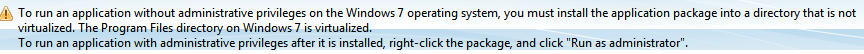

Use Othen Program files Directory to install the product components
We used `C:\opt\ibm` as an installation base for all components.
Following screen-shot shows the C:\ibm as a target installation root

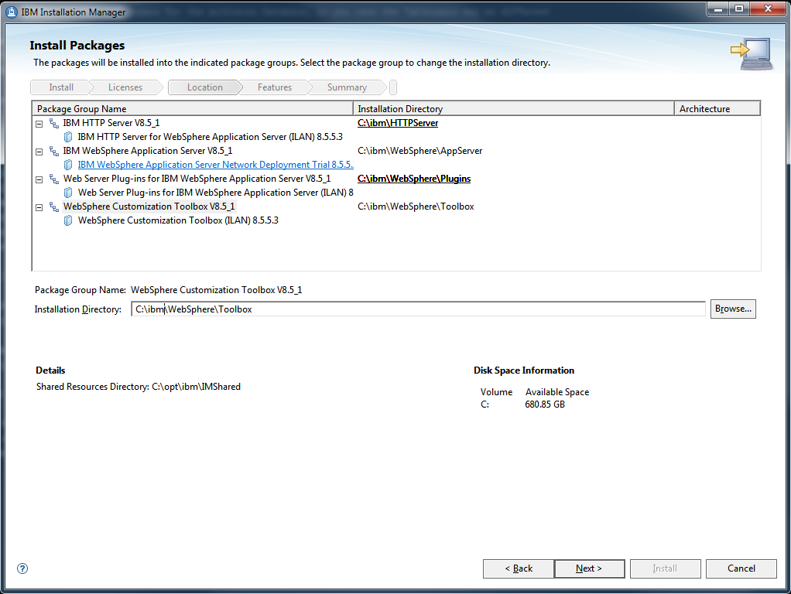

On the next step: select primary language and optional translations (We used only English)
On the next Step: Check final summary of to be installed components and that you have sufficient space on ypur HDD (You will need proximately 3GB of space to install all required WAS components and ActiveVOS)

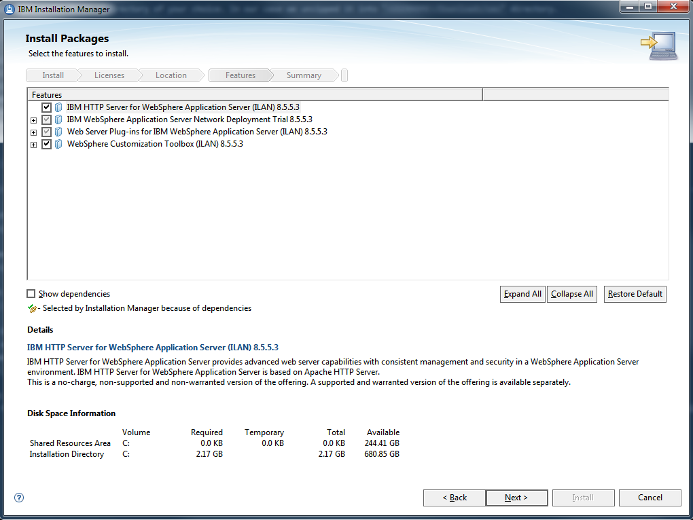

Set the IBM HTTP Server port (use default 80) or optionally choose diferent one if it conflicts with some existing http server on your machine.


Finish the wizard by running the installation. It will take some time to download and install all the components depending on your network bandwidth

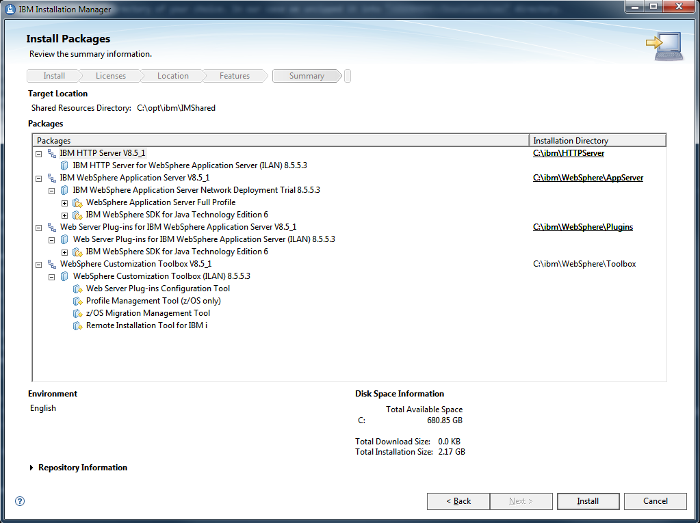

Once installation is complete, you will be prompted to setup profiles for the IBM WebSphere installation, which you should run at this time.

## Configure IBM WebSphere Network Deployment Components
We will use Websphere Customization Toolbox > Profile Management Tool which is automatically started after the successful Websphere components installation. Alternatively you can also start it using Start > IBM Websphere > Websphere Customization Toolbox
### Create Deployment Manager
Run Websphere Customization Toolbox and select

You may accept the name defaults for the deployment manager and cells, or optionally change them if you desire.

### Create Cluster
TBD
### Create Managed Servers
TBD

### Configure ActiveVOS Data Sources
Use following steps to create create a data source for a clustered environment
The first part of this task defines a JDBC provider with a cluster scope setting. Be aware that all members of your cluster must run at least Version 6 of WebSphere Application Server to use this scope setting for the cluster. (See Administrative console scope settings for more information about scope settings in general.)
The cluster scope has a precedence over the node and cell scopes. Create a data source for a cluster if you want the data source to:
* Be available for all the members of this cluster to use
* Override any resource factories that have the same JNDI name that is defined within the cell scope

#### Set DRIVER_PATHS
* Open the WAS administrative console.
* Click WebSphere Variables.
* Check if the `ORACLE_JDBC_DRIVER_PATH` variable exists for the Cluster Nodes
* For each node/cluster, create or edit symbolic variable used in the class path of your JDBC provider, and provide a value that is appropriate for the selected node. For example, we placed the oracle jdbc drive under `C:\opt\java\library\jdbc\oracle`
* Apply and change settings after you finished setting the variables

> NOTE: This DRIVER variable must be defined on each node within the cluster.
> List of variables can be quite long, use filtering as shown on following screenshot 

#### Register J2C User Credential for Database Authentication
Before We Create the data source, we have to save user credentials which will be used to connect to the ActiveVOS database

* Open the WAS administrative console.
* Click `Security > Global Security`
* Click + to expand `Java Authentication and Authorization Service` menu item

* Create a New J2C Alias
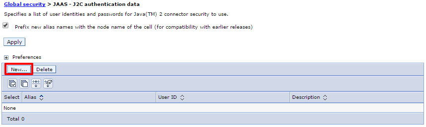
* Create Set Username and password

* Make sure that you save and synchronize changes to the cluster

> NOTE: Node Agent and Cell deployment manager may need to be restarted to apply the changes and make the new credentials alias available to the cluster nodes. Otherwise you may not be able to validate the data source connection.

#### Register JDBC Provider
* Open the WAS administrative console.
* Click `Resources > JDBC Providers` . In the Scope section, note that the default scope setting is at the node level.
* Select the cluster for which you want to define a data source. In our case this is `ActiveVOS_Cluster` which you going to slect in the Scope List.
* Click New to create a new JDBC provider at the cluster level. The class path for your new JDBC provider is already filled in; part of that class path is specified using a symbolic variable, for example: `${ORACLE_JDBC_DRIVER_PATH}/ojdbc6.jar`. Leave it at the default.
* Finish creating the JDBC provider.

#### Create ActiveVOS Data Source
* Open the WAS Administration Console
* Click `Resources > Data sources`.
* Select the Cluster Scope `ActiveVOS_CLuster`
* Click `New` button to create a new data source
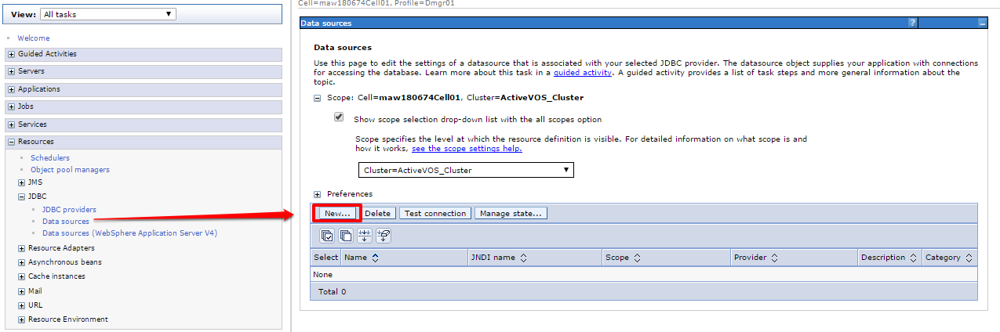
* Specify DS Name and JNDI Name

* Specify JDBC Provider - In our case we are selection previously created Oracle JDBC Driver
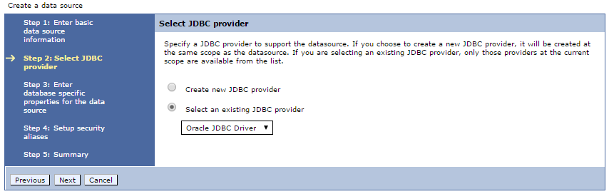
* Specify JDBC URL (it will be different in your environment)

* Select Security Aliases Previously defined in the Register J2C User Credential for Database Authentication Step

* Review and finish your setting

* Make sure you save and synchronize your changes to the cluster nodes.
* Test the database connection
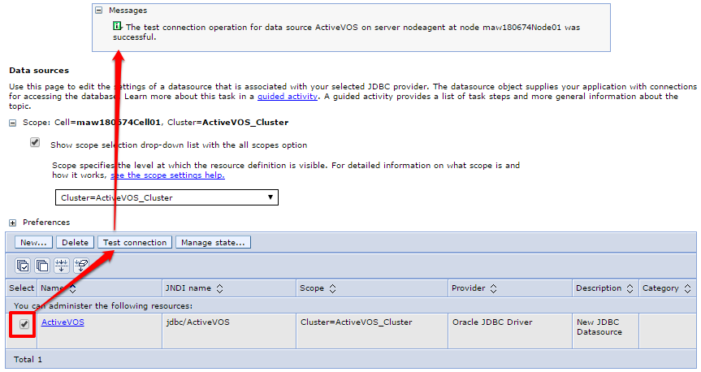

Data Source Parameters List Summary:

|                           Options                           |                        Values                        |
|-------------------------------------------------------------|------------------------------------------------------|
| Scope                                                       | cells:maw180674Cell01:clusters:ActiveVOS_Cluster     |
| Data source name                                            | ActiveVOS                                            |
| JNDI name                                                   | jdbc/ActiveVOS                                       |
| Select an existing JDBC provider                            | Oracle JDBC Driver                                   |
| Implementation class name                                   | oracle.jdbc.pool.OracleConnectionPoolDataSource      |
| URL                                                         | jdbc:oracle:thin:@localhost:1521:XE                  |
| Data store helper class name                                | com.ibm.websphere.rsadapter.Oracle11gDataStoreHelper |
| Use this data source in container managed persistence (CMP) | true                                                 |
| Component-managed authentication alias                      | maw180674CellManager01/activevosdb                   |
| Mapping-configuration alias                                 | (none)                                               |
| Container-managed authentication alias                      | maw180674CellManager01/activevosdb                   |

> NOTE: Activevos does not require XA enabled data source unles Required by the processes that you nay deploy. Regular data source should be suffcient for most of the use cases.

### Install and Configure WAS Web Server Plugins
Web server Plugin is not configured on the IHS Server by Default. WebSphere Customization Toolbox is neded to perform the post-install configuration of the WAS web server plug-in, it contains the configuration tool for the web server plug-in. 

* Run the Customization Toolbox Plug-in Configuration Tool

* Once is the Toolbox Started Add new server Runtime location pointing your Server Location
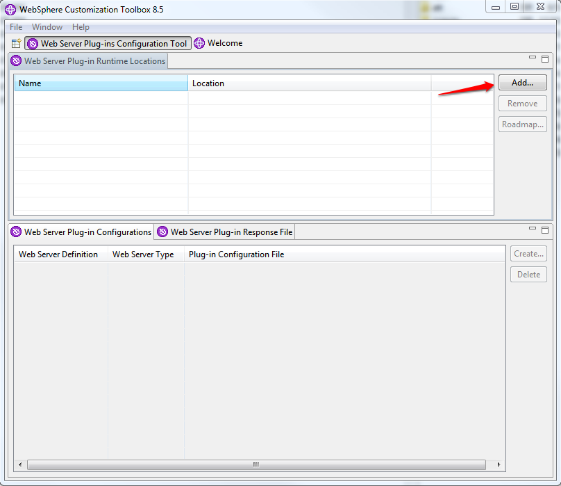
* on the next sceen you will be prompted to speciy your server location
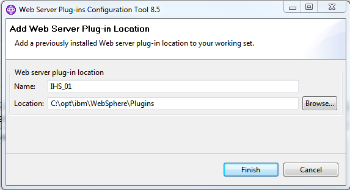
* In the lower section under 'Web Server Plug-in Configurations' click on the create button.
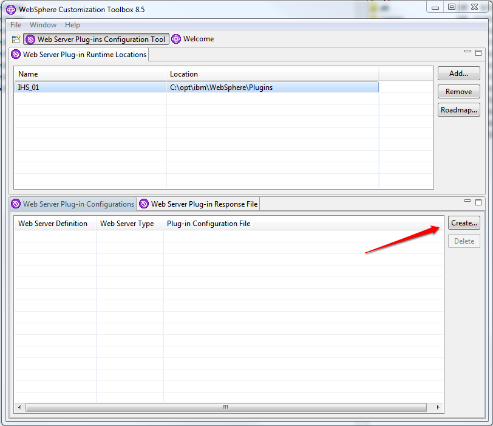
* You will be prompted to select the web server you wish to configure on the first screen. Choose 'IBM HTTP Server 8.5' and click next.

* On the next screen point to your IBM HTTP Server configuration file (httpd.conf) and specify the port your web server is going to listen on and click Finish
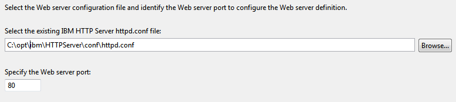
* Setup the Administration Server, check the box 'Setup IBM HTTP Server Administration Server' and specify the port. Default is 8008. Click Next. You can also create a user name and password on this screen, or leave it open and configure the authentication later.

* Next sreen will prompty you for optional Windows service Creation. You can keep the default settings and choose the manual startup option which may be more desirable when you install server in your development sandbox environment.
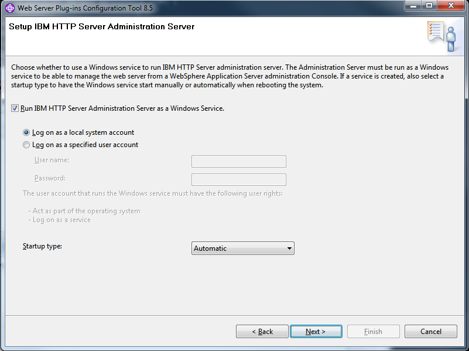
* On the Web Server Definition Name screen, you will want to specify your web server name. If you have already created this via WebSphere you will want this name to match what you see under web servers in the WebSphere console. In our case we chose webserver1, If no web server exists in the WebSphere console you can enter another name.

* On the 'Configuration Scenario Selection' screen, choose if you are doing a local configuration or a remote. If your Application Server exists on a different machine then your web server you will want to choose remote and enter in the Host Name or IP of the Application Server. For this example our Application server is on the same system so we chose 'Local' and pointed to our Application server directory.

* On the last screen of the configuration choose your Application Server profile, click Next and review the information then click Configure.

* Your configuration Wizard screen should now look like you see below. You can close this out now and continue with the last step of the configuration.
* The last step to the profile configuration is to run the script created from the configuration wizard above. It is located in `IBM\WebSphere\Plugins\bin\configure<server_name>.bat` you will get prompt for inputting your WebSphere admin username and password. Once done the output will show 'Configuration save is complete' If you named your web server something different the batch file name will reflect the name you chose and not webserver1.

Example Configure Web Server Output
```
C:\opt\ibm\WebSphere\Plugins\bin>configurewebserver1.bat
WASX7209I: Connected to process "dmgr" on node maw180674CellManager01 using SOAP connector;  The type of process is: DeploymentManager
WASX7303I: The following options are passed to the scripting environment and are available as arguments that are stored in the argv variable: "[webserver1, IHS, C:\\opt\\ibm\\HTTPServer, C:\\opt\\ibm\\HTTPServer\\conf\\httpd.conf, 80, MAP_ALL, C:\\opt\\ibm\\WebSphere\\Plugins, managed, maw180674Node01, new-host-4.home, windows, 8008, admin, admin, IBM HTTP Server V8.5]"

Input parameters:

   Web server name             - webserver1
   Web server type             - IHS
   Web server install location - C:\opt\ibm\HTTPServer
   Web server config location  - C:\opt\ibm\HTTPServer\conf\httpd.conf
   Web server port             - 80
   Map Applications            - MAP_ALL
   Plugin install location     - C:\opt\ibm\WebSphere\Plugins
   Web server node type        - managed
   Web server node name        - maw180674Node01
   IHS Admin port              - 8008
   IHS Admin user ID           - admin
   IHS Admin password          - admin
   IHS service name            - IBM HTTP Server V8.5

Creating the web server definition for webserver1 on node maw180674Node01.
Parameters for administering IHS web server can also be updated using wsadmin script or admin console.
Web server definition for webserver1 is created.

Start computing the plugin properties ID.
Plugin properties ID is computed.

Start updating the plugin install location.
Plugin install location is updated.

Start updating the plugin log file location.
Plugin log file location is updated.

Start updating the RemoteConfigFilename location.
Plugin remote config file location is updated.

Start updating the RemoteKeyRingFileName location.
Plugin remote keyring file location is updated.

Start saving the configuration.

Configuration save is complete.

Computed the list of installed applications.

Processing the application ActiveVOS Central.
Get the current target mapping for the application ActiveVOS Central.
Computed the current target mapping for the application ActiveVOS Central.
Start updating the target mappings for the application ActiveVOS Central.
ADMA5075I: Editing of application ActiveVOS Central started.
ADMA5058I: Application and module versions are validated with versions of deployment targets.
ADMA5005I: The application ActiveVOS Central is configured in the WebSphere Application Server repository.
ADMA5005I: The application ActiveVOS Central is configured in the WebSphere Application Server repository.
ADMA5005I: The application ActiveVOS Central is configured in the WebSphere Application Server repository.
ADMA5005I: The application ActiveVOS Central is configured in the WebSphere Application Server repository.
ADMA5113I: Activation plan created successfully.
ADMA5011I: The cleanup of the temp directory for application ActiveVOS Central is complete.
ADMA5076I: Application ActiveVOS Central edited successfully. The application or its web modules may require a restart when a save is performed.
Target mapping is updated for the application ActiveVOS Central.

Processing the application ActiveVOS Enterprise Server.
Get the current target mapping for the application ActiveVOS Enterprise Server.
Computed the current target mapping for the application ActiveVOS Enterprise Server.
Start updating the target mappings for the application ActiveVOS Enterprise Server.
ADMA5075I: Editing of application ActiveVOS Enterprise Server started.
ADMA5058I: Application and module versions are validated with versions of deployment targets.
ADMA5005I: The application ActiveVOS Enterprise Server is configured in the WebSphere Application Server repository.
ADMA5005I: The application ActiveVOS Enterprise Server is configured in the WebSphere Application Server repository.
ADMA5005I: The application ActiveVOS Enterprise Server is configured in the WebSphere Application Server repository.
ADMA5005I: The application ActiveVOS Enterprise Server is configured in the WebSphere Application Server repository.
ADMA5113I: Activation plan created successfully.
ADMA5011I: The cleanup of the temp directory for application ActiveVOS Enterprise Server is complete.
ADMA5076I: Application ActiveVOS Enterprise Server edited successfully. The application or its web modules may require a restart when a save is performed.
Target mapping is updated for the application ActiveVOS Enterprise Server.

Start saving the configuration.

Configuration save is complete.
```

### Configuring the NodeAgent to start as a Windows Service
> NOTE: these steps does not seem to work right, need to figure out why, I can successfully create the service which actually starts but it is not starting the node manager server.

By default, a Network Deployment installation creates a Windows service for the deployment manager but not the node agent. A Network Deployment application server profile is not fully functional until the NodeAgent for the application server has been started. Starting Node Agent manually is not very desirable. We have the ability to create a Windows Service to automatically start the NodeAgent. 

1. Open a command prompt window
2. Change the current directory to `<instal_root>WebSphere\AppServer\profiles\Node01\bin`
3. Execute the following command to create the NodeAgent service.

> Note: you should replace 'Node01' IBM_HOME username and password with your own parameters. Also make sure WASService.exe and WASServiceMsg.dll exist in this directory. 

```
SETLOCAL
SET IBM_HOME=C:\opt\ibm
SET WAS_HOME=%IBM_HOME%\WebSphere\AppServer
SET PROFILE_PATH=%WAS_HOME%\WebSphere\AppServer\profiles\Node01
SET LOG_ROOT=%PROFILE_PATH%\logs\nodeagent
SET LOG_FILE=%LOG_ROOT%/startServer.log
SET SERVICE_START_TYPE=automatic
SET SERVICE_NAME=nodeAgent
SET STOP_ARGS=-username admin -password admin
WASService -add %SERVICE_NAME% -servername nodeagent -profilePath "%PROFILE_PATH%" -wasHome "%WAS_HOME%" -stopArgs "%STOP_ARGS%" -logfile "%LOG_FILE%" -logRoot "%LOG_ROOT%" -restart true -startType %SERVICE_START_TYPE%
ENDLOCAL
```

EXAMPLE Console Output
```
C:\opt\ibm\WebSphere\AppServer\bin>SETLOCAL
C:\opt\ibm\WebSphere\AppServer\bin>SET IBM_HOME=C:\opt\ibm
C:\opt\ibm\WebSphere\AppServer\bin>SET WAS_HOME=%IBM_HOME%\WebSphere\AppServer
C:\opt\ibm\WebSphere\AppServer\bin>SET PROFILE_PATH=%WAS_HOME%\WebSphere\AppServer\profiles\Node01
C:\opt\ibm\WebSphere\AppServer\bin>SET LOG_ROOT=%PROFILE_PATH%\logs\nodeagent
C:\opt\ibm\WebSphere\AppServer\bin>SET LOG_FILE=%LOG_ROOT%nodeAgentService.log
C:\opt\ibm\WebSphere\AppServer\bin>SET SERVICE_START_TYPE=automatic
C:\opt\ibm\WebSphere\AppServer\bin>SET SERVICE_NAME=nodeAgent
C:\opt\ibm\WebSphere\AppServer\bin>SET STOP_ARGS=-username admin -password admin
C:\opt\ibm\WebSphere\AppServer\bin>WASService -add %SERVICE_NAME% -servername nodeagent -profilePath "%PROFILE_PATH%" -wasHome "%WAS_HOME%" -stopArgs "%STOP_ARGS%" -logfile "%LOG_FILE%" -logRoot "%LOG_ROOT%" -restart true -startType %SERVICE_START_TYPE%
Adding Service: nodeAgent
        Config Root: C:\opt\ibm\WebSphere\AppServer\WebSphere\AppServer\profiles\Node01\config
        Server Name: nodeagent
        Profile Path: C:\opt\ibm\WebSphere\AppServer\WebSphere\AppServer\profiles\Node01
        Was Home: C:\opt\ibm\WebSphere\AppServer\
        Start Args:
        Restart: 1
IBM WebSphere Application Server V8.5 - nodeAgent service successfully added.
```

Start the service
```
WASService -start nodeAgent
```

Stop the service
```
WASService -stop nodeAgent
```

Remove the service
```
WASService -remove nodeAgent
```


## Install ActiveVOS

### Install ActiveVOS Config Deploy Tool
[Download](https://mysupport.informatica.com/downloadsView.jspa) ActiveVOS from Informatica My Support Page. Download a distributions for your target platform 

* Windows - `ActiveVOSWindows924.zip`
* UNIX/Linux - `ActiveVOSUnix924.zip`

Extract the distribution file to a directory of your choice
Windows Distribution contains two files
* Designer Installer - `ActiveVOS_Designer_windows_9.2.4.exe`
* Server Installer - `ActiveVOS_Server_windows_9.2.4.exe`

Run ActiveVOS_Server_windows_9.2.4.exe it will install ActiveVOS Configuration and Deployment Tool (config_deploy)


Select Websphere on the Next Step


As with Websphere do not use Program Files Default target location. You can use `C:\ActiveVOS\Server` 
We have used `C:\opt\ae\9.2.4\server`


> NOTE: When Installing on Windows 2008 or 2012 Server, make sure that the user running the installation or later run config deploy tool has full permissions to the directory and all its children, otherwise You may have permissions issues when the ActiveVOS EARs and WARs are generated by the config deploy tool.

You can accept creation of the Start Menu shortcuts


You will be prompted to open a Quick Start Guide


Read the Quick Start Guide. and keep the link for future reference.
Finish the Installer
