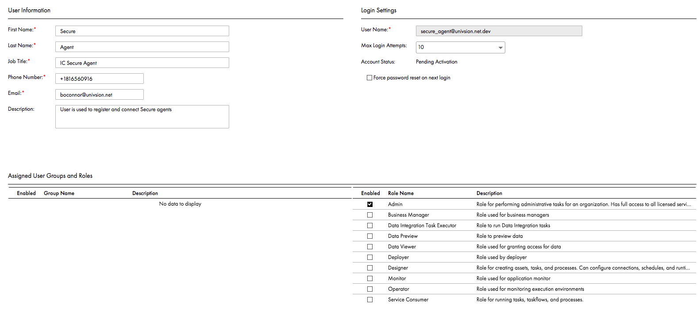

# Informatica Secure Agent Installation 

<!-- MarkdownTOC -->

- [Pre-Requisites](#pre-requisites)
    - [Install Secure Agent](#install-secure-agent)
        - [Download the Secure Agent](#download-the-secure-agent)
            - [APP3 pod](#app3-pod)
            - [IICS NA1 PODS](#iics-na1-pods)
        - [Install Secure Agent](#install-secure-agent-1)
        - [Create Agent Connection User](#create-agent-connection-user)
        - [Initialize Secure Agent and register to your org](#initialize-secure-agent-and-register-to-your-org)
        - [Register the Agent](#register-the-agent)
- [Install Secure Agent as a Daemon](#install-secure-agent-as-a-daemon)
    - [Setup as a Service using systemd](#setup-as-a-service-using-systemd)
        - [Start and Stop service](#start-and-stop-service)
    - [Install Agent as a Service Using init.d](#install-agent-as-a-service-using-initd)
        - [Start and Stop service](#start-and-stop-service-1)
        - [Example Output](#example-output)

<!-- /MarkdownTOC -->

# Pre-Requisites

Please consult the target Installation platform with Offcial PAM before Installing

[Product Availability Matrix](https://network.informatica.com/docs/DOC-17579)

Create a system user that will run and Secure Agent and own Secure Agent directory
Suggested user name can be `infaagent`, `informatica` or `sagent`
Check that you have enough space on the drive (mount you plant to install)

Run

```shell
df -kh
```

Make sure that at least 1.5 GB is available to Secure Agent

More available space may be needed if local file system will be used to stage flat files or other data locally (data lookups, caching, etc.)
In such  case plan sizing of file system and its usage monitoring accordingly.

Make sure that the Hostname of the Machine resolves correctly to IP and vice versa

```shell
hostname
nslookup $(hostname)
```

Make sure that you can connect to Informatica Cloud servers (Is proxy needed for outbound connections?)

```shell
curl -I https://na1.dm-us.informaticacloud.com/saas/download/linux64/installer/agent64_install.bin
HTTP/1.1 200 OK
Server: Apache-Coyote/1.1
ICS-X: b9af0824-97ec-41de-b61f-653723528900
Accept-Ranges: bytes
ETag: W/"137271056-1526176180000"
Last-Modified: Sun, 13 May 2018 01:49:40 GMT
Content-Type: application/octet-stream;charset=UTF-8
Content-Length: 137271056
Date: Wed, 19 Sep 2018 15:03:37 GMT
Access-Control-Allow-Credentials: true
Strict-Transport-Security: max-age=31536000; includeSubDomains; preload
X-Frame-Options: SAMEORIGIN
Set-Cookie: SERVERID_SAAS=IICS-saas8225480; path=/
Cache-control: private
```

## Install Secure Agent

> Note that the actual URL might be different based on the org you using, always make sure that you download the binary from the specific host site which your org is assigned to (app3, app2, iics)

### Download the Secure Agent

#### APP3 pod

```shell
curl -o /tmp/agent64_install.bin https://app3.informaticacloud.com/saas/download/linux64/installer/agent64_install.bin
```

or

```shell
wget -O /tmp/agent64_install.bin https://app3.informaticacloud.com/saas/download/linux64/installer/agent64_install.bin
```

#### IICS NA1 PODS

```shell
curl -o /tmp/agent64_install.bin https://na1.dm-us.informaticacloud.com/saas/download/linux64/installer/agent64_install.bin
```

or

```shell
wget -O /tmp/agent64_install.bin https://na1.dm-us.informaticacloud.com/saas/download/linux64/installer/agent64_install.bin
```

### Install Secure Agent

```shell
# use chmod to set the binary as executable
mkdir -p /opt/infaagent
chmod +x /tmp/agent64_install.bin
/tmp/agent64_install.bin -i silent
```

The secure agent will be installed to the `~/infaagent` directory of the user which runs the installer
Install agent to a different directory: `/tmp/agent64_install.bin -i silent -DUSER_INSTALL_DIR=<target directory>`
You can run secure agent installer in interactive console mode  which will allow you to change some configuration options such as installation to different than default directory.

```text
user@host ~ $ /tmp/agent64_install.bin -i console
Preparing to install...
Extracting the JRE from the installer archive...
Unpacking the JRE...
Extracting the installation resources from the installer archive...
Configuring the installer for this system's environment...

Launching installer...

/===============================================================================
Informatica Cloud Secure Agent                   (created with InstallAnywhere)
/-------------------------------------------------------------------------------

Preparing CONSOLE Mode Installation...
/===============================================================================
Choose Install Folder
/---------------------

Where would you like to install?

  Default Install Folder: /home/iclab/infaagent

ENTER AN ABSOLUTE PATH, OR PRESS <ENTER> TO ACCEPT THE DEFAULT
      : /opt/infaagent
```

### Create Agent Connection User

Create User that will be used to register connect secure agent to Informatica Cloud i.e. `secure_agent_dev@acme.com` as Administrator


### Initialize Secure Agent and register to your org

`consoleAgentManager` is a tool used to configure and manage agent settings, it is located in the `<agent_home>/apps/agentcore` directory.
You can use it to manage various settings and initialize the agent.

<pre>
/home/iclabinfaagent/apps/agentcore $ ./consoleAgentManager.sh
JAVA_HOME=/home/iclab/infaagent/apps/agentcore/../../jre
Console Agent Manager

Usage:
Use "./program help" to print this page. This is also the default operation.
./program OPERATION ARG1 ARG2...

Operations:

configure USERNAME PASSWORD
Configure the Agent Core with IOD username and password. After the Agent Core is configured, it belongs to the user and is ready to run jobs. If the Agent Core is already configured when this operation is executed, the Agent Core shuts down the previous process. This operation returns "succeeds" if the configuration succeeds and "fails" if it fails. Additional information maybe provided for the explanation of a configuration failure. Please refer to the AgentV3 functional specification for further information.

configureToken USERNAME TOKEN
Configure the Agent Core with IOD username and install token. After the Agent Core is configured, it belongs to the user and is ready to run jobs. If the Agent Core is already configured when this operation is
executed, the Agent Core shuts down the previous process. This operation returns "succeeds" if the configuration succeeds and "fails" if it fails. Additional information maybe provided for the explanation of a
configuration failure. Please refer to the AgentV3 functional specification for further information.

shutdown
Shutdown the agent.

shutdownNoLog
Shutdown the agent without generating any logs.

getStatus
Get the status of the agent.

updateStatus
Refresh the status of the agent. This maybe required for getStatus to return the correct status if the connectivity environment of the agent is changed.

isConfigured
Check if the agent is configured.

isConfigurationValid
Check if the agent's configuration is valid.

logMessage MSG
Log a message to the Agent Core. The message can be seen in the log of the Agent Core.

removePackages
Remove all packages from the agent.

removeApps
Remove all applications from the agent.

configureProxy
Configures proxy settings with proxyHost proxyPort proxyUsername proxyPassword passed as arguments. The proxyUsername and proxyPassword arguments are optional.
</pre>

### Register the Agent

Use Following commands to setup your agent after installation

```shell
cd /home/iclab/infaagent/apps/agentcore/
# check the status, for a new silent installed agent the status should be 'NOT_CONFIGURED'
./consoleAgentManager.sh getStatus
# Start Agent core
./infaagent startup
# register agent - after successful login agent core will initialize your agent and download updates and all your enabled components such as process engine and connectors
./consoleAgentManager.sh configure <userId> <password>
```

If you have a proxy http setup for your environment, you will have to configure proxy before  running configure command by using the `configureProxy` command:

```shell
/home/iclabinfaagent/apps/agentcore/consoleAgentManager.sh configureProxy <ProxyHost> <ProxyPort> <ProxyUser> <ProxyPassword>
```

# Install Secure Agent as a Daemon

Read Systemd Documentation
https://www.freedesktop.org/software/systemd/man/systemd.service.html

## Setup as a Service using systemd

Create `infaagent.service` file in `/etc/systemd/system`

```ini
[Unit]
Description=Informatica Secure Agent Service

[Service]
# user which will run agent
User=<user>
# following must be an absolute path typically <agent_home> will be /home/user/infagent
ExecStart=<agent_home>/apps/agentcore/infaagent startup
ExecReload=<agent_home>/apps/agentcore/infaagent shutdown
ExecReload=<agent_home>/apps/agentcore/infaagent startup
ExecStop=<agent_home>/apps/agentcore/infaagent shutdown
Type=forking
TimeoutStopSec=240
Restart=on-failure
RestartSec=5

[Install]
WantedBy=multi-user.target
```

Example `infaagent.service`

```ini
[Unit]
Description=Informatica Secure Agent Service

[Service]
User=iclab
WorkingDirectory=/home/iclab/infaagent/apps/agentcore
ExecStart=/home/iclab/infaagent/apps/agentcore/infaagent startup
ExecReload=/home/iclab/infaagent/apps/agentcore/infaagent shutdown
ExecReload=/home/iclab/infaagent/apps/agentcore/infaagent startup
ExecStop=/home/iclab/infaagent/apps/agentcore/infaagent shutdown
TimeoutStopSec=240
Type=forking
Restart=on-failure
RestartSec=5

[Install]
WantedBy=multi-user.target
```

Reload the systemd

```shell
sudo systemctl daemon-reload
```

Enable Service
this command will enable service and create symlink to a specific startup group

```shell
sudo systemctl enable infaagent.service
```

### Start and Stop service

You can use the following commands to start/stop your new service:

```shell
sudo systemctl start infaagent
sudo systemctl stop infaagent
sudo systemctl restart infaagent
sudo systemctl status infaagent
```

Example service status after start
Note that you can see all other child processes started by Agent core

```text
[iclab@iclab] [Sep 07, 2017 17:58:34]   /home/iclab/infaagent/apps/agentcore
$ sudo systemctl status infaagent
* infaagent.service - Informatica Secire Agent Service
   Loaded: loaded (/etc/systemd/system/infaagent.service; enabled; vendor preset: enabled)
   Active: active (running) since Mon 2017-09-18 12:37:04 EDT; 2min 9s ago
  Process: 62748 ExecStop=/home/iclab/infaagent/apps/agentcore/infaagent shutdown (code=exited, status=0/SUCCESS)
  Process: 63037 ExecStart=/home/iclab/infaagent/apps/agentcore/infaagent startup (code=exited, status=0/SUCCESS)
 Main PID: 63047 (sh)
    Tasks: 174
   Memory: 1.4G
      CPU: 1min 54.183s
   CGroup: /system.slice/infaagent.service
           ├─63047 sh ./agent_start.sh
           ├─63056 /bin/sh ./runAgentCore.sh
           ├─63064 /home/iclab/infaagent/apps/agentcore/../../jre/bin/java -Djava.util.logging.SimpleFormatter.format=%1$tF %1$tT.%1$tL %1$tZ %4$s [%2$s] %5$s%6$s%n -Dlog4j.configuration=file:/home/iclab/infaa
           ├─63108 /bin/sh ./start.sh
           ├─63110 /home/iclab/infaagent/jre/bin/java -Xrs -Xms8m -Xmx16m -ea -esa -classpath /home/iclab/infaagent/apps/Administrator/1.0.1/agent-administrator-app.jar:/home/iclab/infaagent/apps/Administrator
           ├─63179 /home/iclab/infaagent/apps/process-engine/data/db/postgresql-linux-x64-binaries/pgsql/bin/postgres -D /home/iclab/infaagent/apps/process-engine/data/PostGreSql/Data
           ├─63185 postgres: logger process
           ├─63187 postgres: checkpointer process
           ├─63188 postgres: writer process
           ├─63189 postgres: wal writer process
           ├─63190 postgres: autovacuum launcher process
           ├─63191 postgres: stats collector process
           ├─63418 /home/iclab/infaagent/jre/bin/java -Djava.util.logging.config.file=/home/iclab/infaagent/apps/process-engine/1091.4/conf/logging.properties -Djava.util.logging.manager=org.apache.juli.ClassL
           ├─63449 /bin/sh /home/iclab/infaagent/apps/Data_Integration_Server/27.0.5/ICS/main/tomcat/saas-infaagentapp.sh
           ├─63454 /home/iclab/infaagent/jre/bin/java -ea -esa -Ddtm.path=../bin/rdtm -Dsun.reflect.inflationThreshold=0 -cp :.:./saas-apploader.jar:lib/tomcat-embed-core.jar:lib/tomcat-embed-jasper.jar:lib/to
           ├─63485 postgres: bpeluser activevos 127.0.0.1(48762) idle
           ├─63554 postgres: bpeluser activevos 127.0.0.1(48764) idle
           ├─63555 postgres: bpeluser activevos 127.0.0.1(48766) idle
           ├─63613 /bin/sh /home/iclab/infaagent/apps/Data_Integration_Server/27.0.5/.lcm/status-wrapper.sh
           ├─63615 /bin/sh ./ics_status.sh
           └─63618 /home/iclab/infaagent/jre/bin/java -Xrs -Xms8m -Xmx256m -classpath ./lib/*: -Dlog4j.configuration=file:lib/log4j.properties com.informatica.saas.di.app.script.StatusScript

Sep 18 12:37:04 iclab systemd[1]: Stopped Informatica Secire Agent Service.
Sep 18 12:37:04 iclab systemd[1]: Starting Informatica Secire Agent Service...
Sep 18 12:37:04 iclab systemd[1]: Started Informatica Secire Agent Service.

```

## Install Agent as a Service Using init.d

See a documentation

- [SuSe](https://www.suse.com/documentation/sles11/book_sle_admin/data/sec_boot_init.html)
- [Debian](https://wiki.debian.org/LSBInitScripts)

Following method should work universally on any distribution

- Crete file or copy [examples/agent.initd.sh](examples/agent.initd.sh) to  /etc/initt.d as `infaagent`
- Make sure that you edit the `WORK_DIR` variable in the file to point to actual full path to agentcore component
- Make that you update the `DAEMON_USER` variable to refer to a user who owns and runs the secure agent (note that the secure agent can't run as root)

This method will work even on systems with systemd as primary service init scheduler,

You will have to enable this service by running  `sudo systemctl enable infaagent`

In such case you can also manage and check status of the service using `systemctl` command

```text
➜ [iclab@iclab] [Feb 27, 2018 12:33:00]   ~
$ sudo systemctl status infaagent
● infaagent.service - LSB: Start InfaAgent.
   Loaded: loaded (/etc/init.d/infaagent; bad; vendor preset: enabled)
   Active: active (exited) since Tue 2018-02-27 12:09:01 EST; 24min ago
     Docs: man:systemd-sysv-generator(8)
  Process: 1913 ExecStart=/etc/init.d/infaagent start (code=exited, status=0/SUCCESS)
    Tasks: 0
   Memory: 0B
      CPU: 0

Feb 27 12:08:59 iclab systemd[1]: Starting LSB: Start InfaAgent....
Feb 27 12:08:59 iclab infaagent[1913]: Agent Script:   /home/iclab/infaagent/apps/agentcore/infaagent
Feb 27 12:08:59 iclab infaagent[1913]: Agent PID File: /home/iclab/infaagent/apps/agentcore/infaagentprocessid
Feb 27 12:08:59 iclab infaagent[1913]: Agent Core Log: /home/iclab/infaagent/apps/agentcore/agentcore.log
Feb 27 12:09:00 iclab su[1953]: Successful su for iclab by root
Feb 27 12:09:00 iclab su[1953]: + ??? root:iclab
Feb 27 12:09:00 iclab su[1953]: pam_unix(su:session): session opened for user iclab by (uid=0)
Feb 27 12:09:01 iclab infaagent[1913]: Started [1956]
Feb 27 12:09:01 iclab systemd[1]: Started LSB: Start InfaAgent..

```

```shell
#!/bin/bash

### BEGIN INIT INFO
# Provides:          infaagent
# Required-Start:    $local_fs $remote_fs $network
# Required-Stop:     $local_fs $remote_fs $network
# Should-Start:      $named
# Should-Stop:       $named
# Default-Start:     2 3 4 5
# Default-Stop:      0 1 6
# Short-Description: Start InfaAgent.
# Description:       Start the Informatica Secure Agent.
### END INIT INFO

# Specify Dierectory where is the Agent Installed
WORK_DIR=/home/iclab/infaagent/apps/agentcore
# Specify user unde which tghe agent will run
# this should be a user that owns the dir wher the agent is installed
# Secure Agent ca't be run as root
DAEMON_USER='iclab'

# ***********************************************
## DO NOT MODIFY lines below
# ***********************************************

START_SCRIPT=$WORK_DIR/infaagent
PID_FILE=$WORK_DIR/infaagentprocessid

START_ARGS='startup' # start script arguments
STOP_ARGS='shutdown' # stop script arguments
DAEMON=$START_SCRIPT

# colors
red='\e[0;31m'
green='\e[0;32m'
yellow='\e[0;33m'
reset='\e[0m'

echoRed() { echo -e "${red}$1${reset}"; }
echoGreen() { echo -e "${green}$1${reset}"; }
echoYellow() { echo -e "${yellow}$1${reset}"; }

echo "Agent Script:   $DAEMON"
echo "Agent PID File: $PID_FILE"
echo "Agent Core Log: $WORK_DIR/agentcore.log"


start() {
  command="cd $WORK_DIR && $DAEMON $START_ARGS"
  su "$DAEMON_USER" -c "$command"
  if [ -f "$PID_FILE" ]; then
    PID=$(cat $PID_FILE)
  fi
}

stop() {
  command="cd $WORK_DIR && ./infaagent $STOP_ARGS"
  su "$DAEMON_USER" -c "$command"
  echo 'Stopped'
}


case "$1" in
start)
    if [ -f "$PID_FILE" ]; then
        PID=$(cat $PID_FILE)
        if [ -z "$(pgrep -F $PID_FILE)" ]; then
            start
        else
            echoYellow "Already running [$PID]"
            exit 0
        fi
    else
        start
    fi

    if [ -z "$PID" ]; then
        echoRed "Failed starting agent"
        exit 3
    else
        echoGreen "Started [$PID]"
        exit 0
    fi
;;

status)
    if [ -f "$PID_FILE" ]; then
        PID=$(cat $PID_FILE)
        if [ -z "$(pgrep -F $PID_FILE)" ]; then
            echoRed "Not running (process dead but pidfile exists)"
            exit 1
        else
            echoGreen "Running [$PID]"
            exit 0
        fi
    else
        echoRed "Not running"
        exit 3
    fi
;;

stop)
    if [ -f "$PID_FILE" ]; then
        PID=$(cat $PID_FILE)
        if [ -z "$(pgrep -F $PID_FILE)" ]; then
            echoRed "Not running (process dead but pidfile exists)"
            exit 1
        else
            stop
            exit 0
        fi
    else
        echoRed "Not running (pid not found)"
        exit 3
    fi
;;

restart)
    $0 stop
    $0 start
;;

*)
    echo "Usage: $0 {status|start|stop|restart}"
    exit 1
esac
```

### Start and Stop service

```shell
## start agent
sudo /etc/init.d/infaagent start

## stop agent
sudo /etc/init.d/infaagent stop

## get status
sudo /etc/init.d/infaagent status

## restart agent
sudo /etc/init.d/infaagent restart
```

### Example Output

```text
[iclab@iclab] [Feb 27, 2018 11:37:55]   ~
$ sudo /etc/init.d/infaagent stop
Agent Script:   /home/iclab/infaagent/apps/agentcore/infaagent
Agent PID File: /home/iclab/infaagent/apps/agentcore/infaagentprocessid
Agent Core Log: /home/iclab/infaagent/apps/agentcore/agentcore.log
Stopped

[iclab@iclab] [Feb 27, 2018 11:40:08]   ~
$ sudo /etc/init.d/infaagent start
Agent Script:   /home/iclab/infaagent/apps/agentcore/infaagent
Agent PID File: /home/iclab/infaagent/apps/agentcore/infaagentprocessid
Agent Core Log: /home/iclab/infaagent/apps/agentcore/agentcore.log
Started [9792]

[iclab@iclab] [Feb 27, 2018 11:45:05]   ~
$ sudo /etc/init.d/infaagent status
Agent Script:   /home/iclab/infaagent/apps/agentcore/infaagent
Agent PID File: /home/iclab/infaagent/apps/agentcore/infaagentprocessid
Agent Core Log: /home/iclab/infaagent/apps/agentcore/agentcore.log
Running [9792]

```