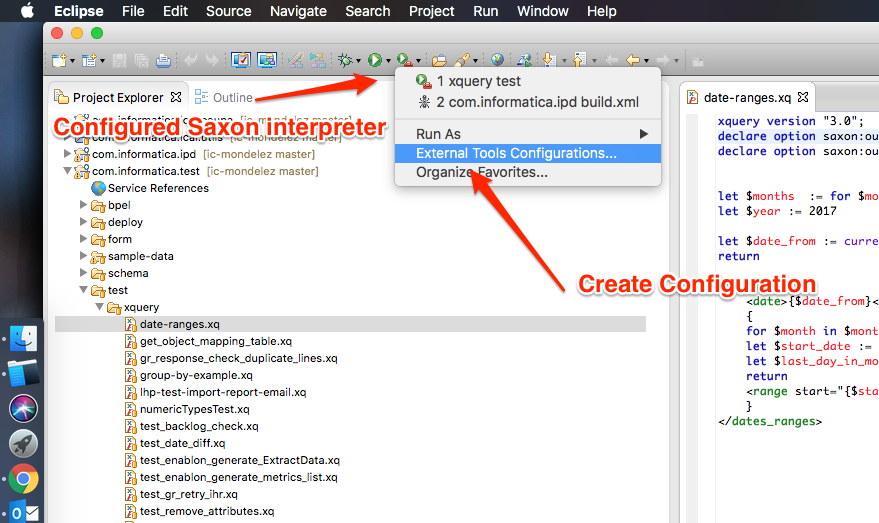
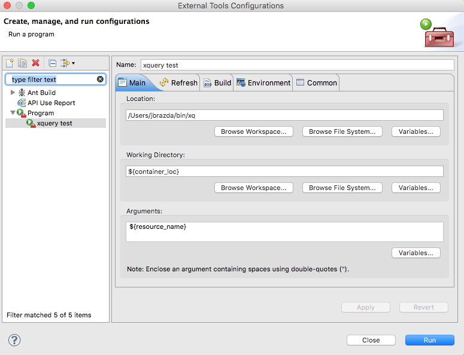
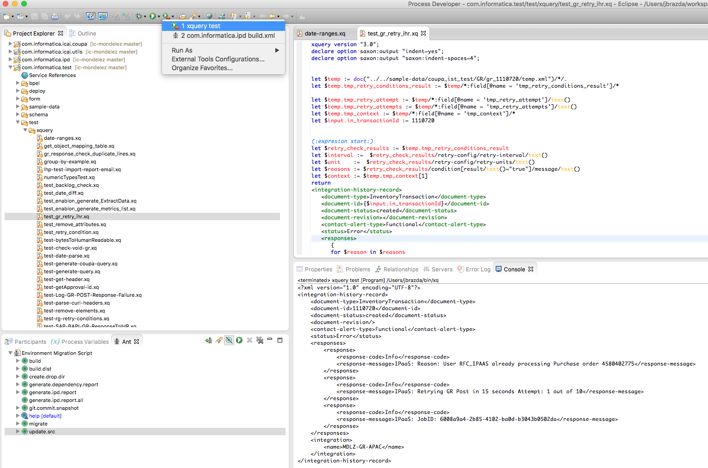

# Install Process Developer

This Guide is specific to Informatica Process developer currently available for download on APP2, APP3 and IICS CLoud platforms
It is tested on following OS Versions but it should work on any macOS 12.x or higher or Linux with 1.7.x JDK Installed

- Ubuntu 16.04 LTS
- macOS 10.12.6 (16G1212)
- macOS 10.13.4 (17E199)

Eclipse for RCP and RAP Developers
Version: Kepler Service Release 2
Build id: 20140224-0627

Process Developer Component Versions:
  Informatica Process Developer 9.33.0.201803021154 com.activevos.complete.product
  Informatica Process Developer Add-on Components 9.33.0.201803021154 com.activee.complete.feature.feature.group
  Informatica Process Developer Screenflow Components 3.35.0.201803021127 com.activevos.socrates.feature.feature.group

<!-- MarkdownTOC -->

- [Installations](#installations)
    - [Direct Links](#direct-links)
- [Installation alternatives](#installation-alternatives)
    - [Direct Links - Eclipse Download](#direct-links---eclipse-download)
- [Installing on Linux](#installing-on-linux)
- [Installing on Mac OS](#installing-on-mac-os)
- [Informatica Cloud Process Developer Plug-in Installation](#informatica-cloud-process-developer-plug-in-installation)
    - [Installing](#installing)
    - [Running the Designer](#running-the-designer)
- [Process Developer Issues on macOS and Linux](#process-developer-issues-on-macos-and-linux)
    - [XQuery Interpreter Fails with ClassNotFoundException](#xquery-interpreter-fails-with-classnotfoundexception)

<!-- /MarkdownTOC -->

## Installations

Informatica Process Developer is distributed in two ways

1. Windows Installer which Includes JRE, Eclipse And Informatica Process Developer plug-in
2. Standalone plug-ins in zip archive

Windows distribution is only 32 bit which limits your eclipse runtime use to relatively small JVM size.
To Download Process Developer go to you Informatica Cloud Org Console/ Process Designer and select the Forms Tab on the left Navigation pane

### Direct Links

- [Windows Installer](http://doc.rt.informaticacloud.com/cpd/Cloud_Process_Developer_windows.zip)
- [Eclipse Plug-ins](http://doc.rt.informaticacloud.com/cpd/Cloud_Process_Developer_plugins.zip)

## Installation alternatives

If you work on lager projects and 32 bit distribution is useful to install 64 bit version of eclipse.
You will need a specific version of Eclipse to install plug-ins based distribution Eclipse Kepler SR2 Packages.

[Eclipse for RCP and RAP Developers](https://www.eclipse.org/downloads/packages/release/Kepler/SR2)

### Direct Links - Eclipse Download

- Windows [32-bit][eclipse win 32-bit] [64-bit][eclipse win 64-bit]
- Mac Cocoa [32-bit][eclipse mac 32-bit] [64-bit][eclipse mac 64-bit]
- Linux [32-bit][eclipse linux 32-bit] [64-bit][eclipse linux 64-bit]

You will also need to download and install JDK 1.7

Download and install JDK specific to your system from [Oracle Website][oracle jdk download]

Use a specific installation for your system

## Installing on Linux

1. Download JDK (tgz distribution)
2. expand tgz
    `sudo tar -xvf jdk-7u80-linux-x64.tar.gz -C '/opt/java'`
3. Download Eclipse Distribution
4. Unzip Eclipse
    `tar -xf eclipse-rcp-kepler-SR2-linux-gtk-x86_64.tar.gz -C 'your_directry of choice'`
5. Edit the /eclipse/eclipse.ini to set the -vm to pint the clpise to a specific jdk
    `-vm`
    `/opt/java/jdk1.7.0_80/jre/bin/java`
6. Run Eclipse
7. Download the Process Developer Plug-ins
8. Unzip the plug-ins
9. Install the plug-ins following the

Example eclipse.ini

```text
-startup
plugins/org.eclipse.equinox.launcher_1.3.0.v20130327-1440.jar
--launcher.library
plugins/org.eclipse.equinox.launcher.gtk.linux.x86_64_1.1.200.v20140116-2212
-product
org.eclipse.epp.package.rcp.product
--launcher.defaultAction
openFile
-showsplash
org.eclipse.platform
--launcher.XXMaxPermSize
384m
--launcher.defaultAction
openFile
--launcher.appendVmargs
-vm
/opt/java/jdk1.7.0_80/jre/bin/java
-vmargs
-Dosgi.requiredJavaVersion=1.6
-XX:MaxPermSize=256m
-Xms512m
-Xmx2G
```

## Installing on Mac OS

Installation on Mac can be tricky as Kepler Eclipse Release is not very well supported in recent Mac OS Versions
if you try to run Eclipse Kepler on macOS Sierra or High Sierra even with Oracle JDK installed, it will refuse to start and show following dialog

1. Download JDK
2. Install JDK
3. Download Eclipse Distribution
4. DO NOT unzip the distribution using double click on the tar.gz archive (mac will not expand the files correctly and you will not be able to run the Eclipse successfully)
5. Open terminal and expand the archive to `/Applications` directory
6. Unzip Eclipse
    `tar -xf eclipse-rcp-kepler-SR2-macosx-cocoa-x86_64.tar.gz -C '/Applications'`
    Be careful if you already have other versions of eclipse installed in Applications
    You may want to rename the default 'eclipse' directory to something like `ipd` or `eclipse_kepler`
7. Edit the `/Applications/eclipse_kepler/Eclipse.app/Contents/MacOS/eclipse.ini` to set the -vm to point the Eclipse to a specific jdk
    `-vm`
    `/Library/Java/JavaVirtualMachines/jdk1.7.0_80.jdk/Contents/Home/jre/lib/server/libjvm.dylib`
8. Set other jvm parameters such as xmx and xms
9. Download the Process Developer Plug-ins
10. Unzip the plug-ins
11. Install the plug-ins following the [Informatica Cloud Process Developer Plug-in Installation](#informatica-cloud-process-developer-plug-in-installation)

Example eclipse.ini on Mac

```text
-startup
../../../plugins/org.eclipse.equinox.launcher_1.3.0.v20130327-1440.jar
--launcher.library
../../../plugins/org.eclipse.equinox.launcher.cocoa.macosx.x86_64_1.1.200.v20140116-2212
-product
org.eclipse.epp.package.rcp.product
--launcher.defaultAction
openFile
-showsplash
org.eclipse.platform
--launcher.XXMaxPermSize
256m
--launcher.defaultAction
openFile
--launcher.appendVmargs
-vm
/Library/Java/JavaVirtualMachines/jdk1.7.0_80.jdk/Contents/Home/jre/lib/server/libjvm.dylib
-vmargs
-Dosgi.requiredJavaVersion=1.6
-XstartOnFirstThread
-Dorg.eclipse.swt.internal.carbon.smallFonts
-XX:MaxPermSize=384m
-Xms512m
-Xmx4096m
-Xdock:icon=../Resources/Eclipse.icns
-XstartOnFirstThread
-Dorg.eclipse.swt.internal.carbon.smallFonts
```

## Informatica Cloud Process Developer Plug-in Installation

### Installing

1. Select the `install new software` option from the help menu.
2. Click the add button.
3. Enter a name and click the local button.
4. Select the `updatesite` folder included with this distribution.
5. Click the OK button.
6. Uncheck the `Group items by category` checkbox.
7. Click "Select All"
8. Click next and follow the prompts to complete the install.
9. Depending on the particular Eclipse version or configuration you are running, you may come to a dialog entitled "Install Remediation Page".  If so select the "Update my installation to be compatible with the items being installed" option and follow the prompts.

### Running the Designer

Installing the Informatica Cloud Process Developer License

- Start Eclipse.
- When Eclipse first starts, select the `Activate` button when prompted.
- Enter your name and `browse` to the license.lic file included with this distribution in `Cloud_Process_Developer_plugins/license`
- Select the `Update` button.
- Select `OK` on the update confirmation dialog.
- Switch to the Process Developer perspective (Window / Open Perspective / Other / Process Developer)

## Process Developer Issues on macOS and Linux

There Are several issues running Process Developer on Mac but I have found some workarounds

### XQuery Interpreter Fails with ClassNotFoundException

I have tried almost everything to  make the editors runtime working under macOS and Linux, but it does not work, just throwing follwoing exception when running main module

```text
Error: Could not find or load main class
Caused by: java.lang.ClassNotFoundException:
```

Only way to workaround this was to run the XQuery Saxon runtime as external tool. I created xq script in ~/bin directory.
You can also put this script into /usr/local/bin directory or create an alias to it in your shell configuration whichever method you prefer.
This script runs the Saxon externally. Note that the `JAVA_HOME` and `AE_RUNTIME_LIB` can be different in your environment depending which version of JAVA and Process Developer you have.

Script is designed to run on macOS, Linux, Windows+Cygwin

```shell
#!/bin/bash

#you can define these variables also globally in .profile or .bashrc, .zshrc
JAVA_HOME='/Library/Java/JavaVirtualMachines/jdk1.7.0_80.jdk/Contents/Home'
AE_RUNTIME_LIB='/Applications/eclipse_kepler/plugins/org.activebpel.enginep_9.33.0.201803021154/server/shared/lib'

cygwin=false
darwin=false
UNAME=$(uname)
case "$UNAME" in
CYGWIN*) cygwin=true;;
Darwin*) darwin=true;;
esac

# PRGDIR=$(dirname "$0")

if [ -z "$AE_RUNTIME_LIB" ]; then
    echo 'AE_RUNTIME_LIB variable must be set in order to run this command'
    echo 'In case of developer machine set this variable to AE_DESIGNER_HOME/Bunit Ant Runtime/lib'
    exit 1
fi

# on cygwin ensure unix path is used
if $cygwin; then
  [ -n "$JAVA_HOME" ] && JAVA_HOME=$(cygpath --unix "$JAVA_HOME")
  [ -n "$CLASSPATH" ] && CLASSPATH=$(cygpath --path --unix "$CLASSPATH")
  [ -n "$AE_RUNTIME_LIB" ] && AE_RUNTIME_LIB=$(cygpath --path --unix "$AE_RUNTIME_LIB")
fi

RUN_JAVA=$JAVA_HOME/bin/java

#set AE classpath
CLASSPATH="$AE_RUNTIME_LIB/saxon-pe-9.5.1.10.jar:$AE_RUNTIME_LIB/org.activebpel.rt.bpel.ext.expr.jar"


# For Cygwin, switch paths to Windows format before running java
if $cygwin; then
  JAVA_HOME=$(cygpath --absolute --windows "$JAVA_HOME")
  CLASSPATH=$(cygpath --path --windows "$CLASSPATH")
  AE_RUNTIME_LIB=$(cygpath --path --windows "$AE_RUNTIME_LIB")
fi

# echo "$RUN_JAVA" "$JAVA_OPTS" -cp "$CLASSPATH" org.activebpel.rt.bpel.ext.expr.impl.xquery.AeQuery -qversion:3.0 "$@"

"$RUN_JAVA" $JAVA_OPTS -cp $CLASSPATH org.activebpel.rt.bpel.ext.expr.impl.xquery.AeQuery -qversion:3.0 "$@"
```

This script will allow you to run Saxon from command line as shown below (assuming you put your `~/bin` on system path in your shell)

```text
$ xq
No query file name
Saxon-PE 9.5.1.9J from Saxonica
Usage: see http://www.saxonica.com/documentation9.5/using-xquery/commandline.html
Format: org.activebpel.rt.bpel.ext.expr.impl.xquery.AeQuery options params
Options available: -? -backup -catalog -config -cr -dtd -expand -explain -ext -init -l -mr -now -o -opt -outval -p -pipe -projection -q -qs -quit -qversion -r -repeat -s -sa -strip -t -T -TJ -TP -traceout -tree -u -update -val -wrap -x -xi -xmlversion -xsd -xsdversion -xsiloc
Use -XYZ:? for details of option XYZ
Params:
  param=value           Set query string parameter
  +param=filename       Set query document parameter
  ?param=expression     Set query parameter using XPath
  !param=value          Set serialization parameter
```

Then Setup Saxon XQuery interpreter as external tool in Eclipse as follows

1. Create External Tool
  
2. Configure External Tool ponting to your script and resource in your editor
  
3. Now you should be able to run saxon juts by selecting external tool from the drop down when editing the main Saxon module.
  

[eclipse win 32-bit]: http://www.eclipse.org/downloads/download.php?file=/technology/epp/downloads/release/kepler/SR2/eclipse-rcp-kepler-SR2-win32.zip
[eclipse win 64-bit]: http://www.eclipse.org/downloads/download.php?file=/technology/epp/downloads/release/kepler/SR2/eclipse-rcp-kepler-SR2-win32-x86_64.zip
[eclipse mac 32-bit]: http://www.eclipse.org/downloads/download.php?file=/technology/epp/downloads/release/kepler/SR2/eclipse-rcp-kepler-SR2-macosx-cocoa.tar.gz
[eclipse mac 64-bit]: http://www.eclipse.org/downloads/download.php?file=/technology/epp/downloads/release/kepler/SR2/eclipse-rcp-kepler-SR2-macosx-cocoa-x86_64.tar.gz
[eclipse linux 32-bit]: http://www.eclipse.org/downloads/download.php?file=/technology/epp/downloads/release/kepler/SR2/eclipse-rcp-kepler-SR2-linux-gtk.tar.gz
[eclipse linux 64-bit]: http://www.eclipse.org/downloads/download.php?file=/technology/epp/downloads/release/kepler/SR2/eclipse-rcp-kepler-SR2-linux-gtk-x86_64.tar.gz
[oracle jdk download]: http://www.oracle.com/technetwork/java/javase/downloads/java-archive-downloads-javase7-521261.ht:
