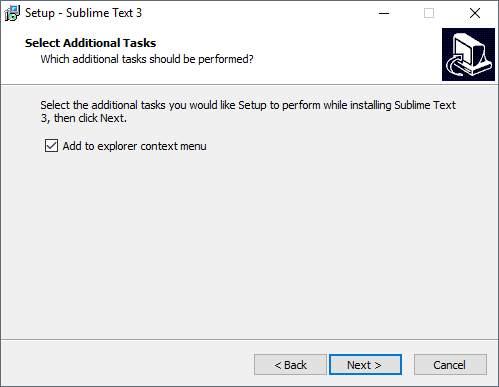
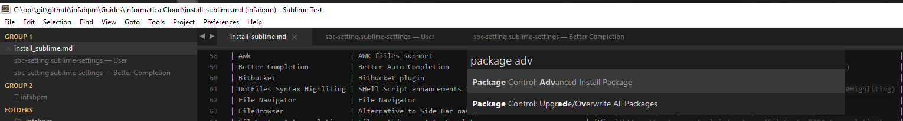
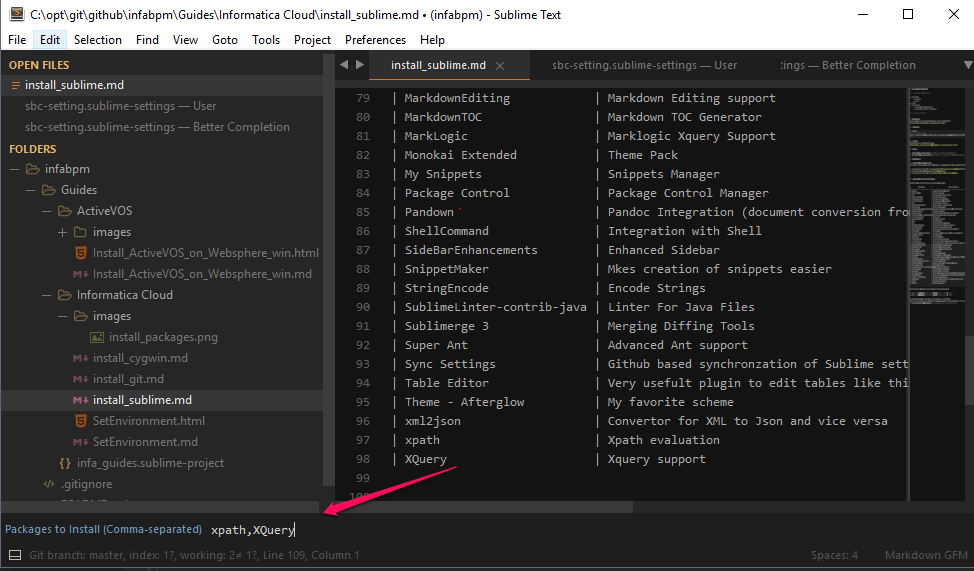

# Install Sublime Text 3

<!-- MarkdownTOC -->

- [Download](#download)
    - [Windows](#windows)
    - [Linux](#linux)
- [Learn](#learn)
- [Configure](#configure)
    - [Install Package Control](#install-package-control)
    - [Install Core set of Packages](#install-core-set-of-packages)
- [Install Multiple Packages](#install-multiple-packages)
- [Configure Sync Settings](#configure-sync-settings)

<!-- /MarkdownTOC -->

## Download

Download and Install Sublime Text 3 for your platform

### Windows

Make sure you Add Integration with windows Shell



### Linux

Follow instructions on this page
https://www.sublimetext.com/docs/3/linux_repositories.html

## Learn

- [Official Documentation](https://www.sublimetext.com/docs/3/)
- [Unofficial Documentation](https://docs.sublimetext.info/en/latest/index.html)

## Configure

### Install Package Control

First to configure is essential plugin - Package Control Manager which can manage pretty much all Sublime plug-ins and extensions

- Follow instructions on this page https://packagecontrol.io/installation or simply select menu `Tools/Install Package Control` in the Sublime Text
- Read the https://packagecontrol.io/docs/usage
- Browse the available packages https://packagecontrol.io/browse

### Install Core set of Packages

Following is the list of my installed packages

|          Package           |                      description                       |                                    link                                   |
|----------------------------|--------------------------------------------------------|---------------------------------------------------------------------------|
| Abacus                     | Code Alignment plugin                                  | [View](https://packagecontrol.io/packages/Abacus)                         |
| Advanced CSV               | CSV Formating                                          | [View](https://packagecontrol.io/packages/Advanced%20CSV)                 |
| Ant                        | Ant Support for Sublime                                | [View](https://packagecontrol.io/packages/Ant)                            |
| Ant Buildfile              | Ant Build System                                       | [View](https://packagecontrol.io/packages/Ant%20Buildfile)                |
| API Blueprint              | API Blueprint plugin                                   | [View](https://packagecontrol.io/packages/API%20Blueprint)                |
| AutoFileName               | Autocomplete File Names                                | [View](https://packagecontrol.io/packages/AutoFileName)                   |
| Awk                        | AWK fiiles support                                     | [View](https://packagecontrol.io/packages/Awk)                            |
| Better Completion          | Better Auto-Completion                                 | [View](https://packagecontrol.io/packages/Better%20Completion)            |
| Bitbucket                  | Bitbucket plugin                                       | [View](https://packagecontrol.io/packages/Bitbucket)                      |
| DotFiles Syntax Highliting | SHell Script enhancements for dotfiles                 | [View](https://packagecontrol.io/packages/DotFiles%20Syntax%20Highliting) |
| File Navigator             | File Navigator                                         | [View](https://packagecontrol.io/packages/File%20Navigator)               |
| FileBrowser                | Alternative to Side Bar navigator                      | [View](https://packagecontrol.io/packages/FileBrowser)                    |
| FileSystem Autocompletion  | File path/names Auto Complete                          | [View](https://packagecontrol.io/packages/FileSystem%20Autocompletion)    |
| FuzzyFilePath              | File path                                              | [View](https://packagecontrol.io/packages/FuzzyFilePath)                  |
| GenerateUUID               | UUID generator                                         | [View](https://packagecontrol.io/packages/GenerateUUID)                   |
| Gist                       | Gist plugin                                            | [View](https://packagecontrol.io/packages/Gist)                           |
| Git                        | Git Integration plugin                                 | [View](https://packagecontrol.io/packages/Git)                            |
| HTMLAttributes             | HTML attributes completions                            | [View](https://packagecontrol.io/packages/HTMLAttributes)                 |
| HTMLBeautify               | Make HTML Human Readable                               | [View](https://packagecontrol.io/packages/HTMLBeautify)                   |
| ImprovedSQL                | Extra syntax which is missing OOTB                     | [View](https://packagecontrol.io/packages/ImprovedSQL)                    |
| Indent XML                 | Format XML                                             | [View](https://packagecontrol.io/packages/Indent%20XML)                   |
| JavaScript Completions     | JavaScript Completions for sublime text.               | [View](https://packagecontrol.io/packages/JavaScript%20Completions)       |
| JSON Reindent              | Format JSON                                            | [View](https://packagecontrol.io/packages/JSON%20Reindent)                |
| JSONLint                   | Validate JSON                                          | [View](https://packagecontrol.io/packages/JSONLint)                       |
| LineEndings                | Convert Line Endings                                   | [View](https://packagecontrol.io/packages/LineEndings)                    |
| LoremIpsum                 | Enter LoremIpsum sample snippets                       | [View](https://packagecontrol.io/packages/LoremIpsum)                     |
| Markdown Preview           | Prview and convert markdown to github HTML             | [View](https://packagecontrol.io/packages/Markdown%20Preview)             |
| MarkdownEditing            | Markdown Editing support                               | [View](https://packagecontrol.io/packages/MarkdownEditing)                |
| MarkdownTOC                | Markdown TOC Generator                                 | [View](https://packagecontrol.io/packages/MarkdownTOC)                    |
| MarkLogic                  | Marklogic Xquery Support                               | [View](https://packagecontrol.io/packages/MarkLogic)                      |
| Monokai Extended           | Theme Pack                                             | [View](https://packagecontrol.io/packages/Monokai%20Extended)             |
| My Snippets                | Snippets Manager                                       | [View](https://packagecontrol.io/packages/My%20Snippets)                  |
| Package Control            | Package Control Manager                                | [View](https://packagecontrol.io/packages/Package%20Control)              |
| Pandown                    | Pandoc Integration (document conversion from Markdown) | [View](https://packagecontrol.io/packages/Pandown)                        |
| ShellCommand               | Integration with Shell                                 | [View](https://packagecontrol.io/packages/ShellCommand)                   |
| SideBarEnhancements        | Enhanced Sidebar                                       | [View](https://packagecontrol.io/packages/SideBarEnhancements)            |
| SnippetMaker               | Mkes creation of snippets easier                       | [View](https://packagecontrol.io/packages/SnippetMaker)                   |
| StringEncode               | Encode Strings                                         | [View](https://packagecontrol.io/packages/StringEncode)                   |
| SublimeLinter-contrib-java | Linter For Java Files                                  | [View](https://packagecontrol.io/packages/SublimeLinter-contrib-java)     |
| Sublimerge 3               | Merging Diffing Tools                                  | [View](https://packagecontrol.io/packages/Sublimerge%203)                 |
| Super Ant                  | Advanced Ant support                                   | [View](https://packagecontrol.io/packages/Super%20Ant)                    |
| Sync Settings              | Github based synchronzation of Sublime settings        | [View](https://packagecontrol.io/packages/Sync%20Settings)                |
| Table Editor               | Very usefult plugin to edit tables like this one       | [View](https://packagecontrol.io/packages/Table%20Editor)                 |
| Theme - Afterglow          | My favorite scheme                                     | [View](https://packagecontrol.io/packages/Theme%20-%20Afterglow)          |
| xml2json                   | Convertor for XML to Json and vice versa               | [View](https://packagecontrol.io/packages/xml2json)                       |
| xpath                      | Xpath evaluation                                       | [View](https://packagecontrol.io/packages/xpath)                          |
| XQuery                     | Xquery support                                         | [View](https://packagecontrol.io/packages/XQuery)                         |

Use following steps to install one or more packages

- Win <kbd>control</kbd> +<kbd>shift</kbd> + <kbd>P</kbd>
- Mac <kbd>&#8984;</kbd> +<kbd>shift</kbd> + <kbd>P</kbd>

Type following to search box `package adv`, select the
and  enter coma separated list of pagage names to be installed i.e. `Sync Settings,xpath,XQuery`





## Install Multiple Packages

use <kbd>comtrol</kbd> +<kbd>shift</kbd> + <kbd>P</kbd>  `Package Control: Advanced Install Package`

> Not You might get range of errors when using this list as-is
> There seem to be a defect in package control 'Package Control: Advanced Install Package' see https://github.com/wbond/package_control/issues/1191
> Just click through all the pop-ups and restart Sublime after, it should be able to install all packages eventually

```text
Advanced CSV,Ant,Ant Buildfile,API Blueprint,AutoFileName,Awk,Better Completion,Bitbucket,DotFiles Syntax Highliting,File Navigator,FileBrowser,FileSystem Autocompletion,FuzzyFilePath,GenerateUUID,Gist,Git,HTMLAttributes,HTMLBeautify,ImprovedSQL,Indent XML,JavaScript Completions,JSON Reindent,JSONLint,LineEndings,LoremIpsum,Markdown Preview,MarkdownEditing,MarkdownTOC,MarkLogic,Monokai Extended,My Snippets,Pandown,ShellCommand,SideBarEnhancements,SnippetMaker,StringEncode,SublimeLinter-contrib-java,Sublimerge 3,Super Ant,Sync Settings,Table Editor,Theme - Afterglow,xml2json,xpath,XQuery
```

## Configure Sync Settings

Use `Sync Settings` plugin which makes synchronization of setting very easy using Github

1. Create Github account if you do not have one https://github.com/join?source=header-home
2. Highly recommend to set two factor authentication https://github.com/settings/security
3. Create Access Key on https://github.com/settings/tokens Name it `Gist Sublime`
4. Create new gist using <kbd>control</kbd> +<kbd>shift</kbd> + <kbd>P</kbd>, type "Sync Create" and select "Sync Settings: Create and Upload" action
6. Now you an use `Sync Settings: Upload` or `Sync Settings: Download ` to backup and synchronize your setting across different Sublime Text installations
