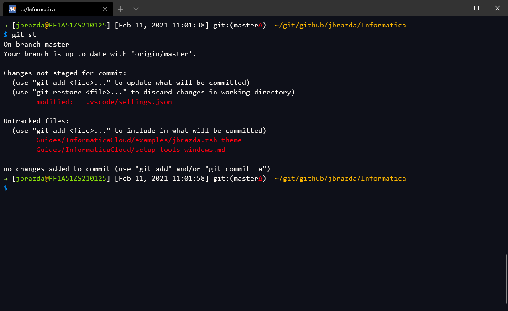

# Windows Tools Setup

<!-- TOC -->

- [Windows Tools Setup](#windows-tools-setup)
  - [Install VS Code](#install-vs-code)
    - [Configure VS Code](#configure-vs-code)
  - [Install Git Client, Shell Zsh](#install-git-client-shell-zsh)
    - [Install MSYS2](#install-msys2)
      - [Install Oh My Zsh](#install-oh-my-zsh)
      - [.aliases](#aliases)
      - [.zshrc](#zshrc)
  - [Install Open JDK](#install-open-jdk)
  - [Install Process Developer](#install-process-developer)
  - [Install Apache Ant](#install-apache-ant)
  - [Install](#install)

<!-- /TOC -->

## Install VS Code

1. Download latest [VS Code](https://code.visualstudio.com/download)
2. Run Installation - [see official documentation](https://code.visualstudio.com/docs/setup/windows)
   1. I Recommend to set it as default editor for common files
   2. VS Code will install to `%USERPROFILE%\AppData\Local\Programs\Microsoft VS Code\Code.exe` by default
   3. Take note of the location as it will be used later to setup other tools such as a Git client and Windows Terminal

### Configure VS Code

If you haven't used VS  Code before I recommend to visit documentations and tutorial pages - [First Steps](https://code.visualstudio.com/docs#first-steps) 
I highly recommend to setup sync to Github, especially if you might use multiple machines to keep your plugins and setting synchronized and backed up

I use number of plugins which help  with many development tasks

I use this command to get list of my currently used Code Extensions

```shell
code --list-extensions | xargs -L 1 echo code --install-extension
```

Which produces (my current list)

```shell
code --install-extension AlanWalk.markdown-navigation
code --install-extension AlanWalk.markdown-toc
code --install-extension alefragnani.project-manager
code --install-extension blackmist.LinkCheckMD
code --install-extension buianhthang.xml2json
code --install-extension christian-kohler.path-intellisense
code --install-extension codezombiech.gitignore
code --install-extension csholmq.excel-to-markdown-table
code --install-extension DavidAnson.vscode-markdownlint
code --install-extension donjayamanne.git-extension-pack
code --install-extension donjayamanne.githistory
code --install-extension DotJoshJohnson.xml
code --install-extension DougFinke.vscode-pandoc
code --install-extension eamodio.gitlens
code --install-extension fcrespo82.markdown-table-formatter
code --install-extension felipecaputo.git-project-manager
code --install-extension heaths.vscode-guid
code --install-extension jakebathman.mysql-syntax
code --install-extension kohkimakimoto.vscode-mac-dictionary
code --install-extension luggage66.AWK
code --install-extension marvinhagemeister.theme-afterglow-remastered
code --install-extension mlxprs.mlxprs
code --install-extension ms-azuretools.vscode-docker
code --install-extension ms-vscode-remote.remote-wsl
code --install-extension ms-vscode.sublime-keybindings
code --install-extension mycelo.oracle-plsql
code --install-extension nickheap.vscode-ant
code --install-extension nidu.copy-json-path
code --install-extension pedroguerra.ant-tree-viewer
code --install-extension redhat.java
code --install-extension redhat.vscode-yaml
code --install-extension RomanPeshkov.vscode-text-tables
code --install-extension Shan.code-settings-sync
code --install-extension streetsidesoftware.code-spell-checker
code --install-extension streetsidesoftware.code-spell-checker-czech
code --install-extension TGV.awk-language-client
code --install-extension timonwong.shellcheck
code --install-extension VisualStudioExptTeam.vscodeintellicode
code --install-extension vscjava.vscode-java-debug
code --install-extension vscjava.vscode-java-pack
code --install-extension vscjava.vscode-java-test
code --install-extension vscjava.vscode-maven
code --install-extension weijunyu.vscode-json-path
code --install-extension yzhang.markdown-all-in-one
code --install-extension ziyasal.vscode-open-in-github
```

## Install Git Client, Shell Zsh

With my new employer I'm migrating my environment from MacOS to Windows and trying to setup similar environment I was used to on Mac. I prefer zsh over bash for interactive shell and use [OhMy zsh](https://ohmyz.sh/) 
While many people just use [Git bash](https://git-scm.com/downloads) for basic git operations I prefer to have full power of  GNU userland tools on my shell.
You can use [WSL 2](https://docs.microsoft.com/en-us/windows/wsl/install-win10) to run full Linux and Windows which might be a problem on some more restricted IT managed machines.
Look into this guide to setup such environment based on WSL 2 and Docker [creating-my-awesome-windows-10-dev-setup](https://chimerical.ca/posts/creating-my-awesome-windows-10-dev-setup)

In the past I was using Cygwin on windows and coming back to windows after many years I was trying to find alternative that gives me direct access to most of the tools I'm used directly in windows without need for virtualization

This time I found something even better [MSYS 2](https://www.msys2.org/) and Windows Terminal are great combination to do all my tasks related shell scripting and git operations almost the same way as I was able to do on Mac

### Install MSYS2

Follow the steps here to do basic installation with only one change I prefer to install tools like jdk, shell and third party libraries under /opt on all my systems so on Windows I installed the MSYS2 under 
`C:\opt\msys64`
Doing the same will make it easier to follow my other settings including setup of great new Windows terminal (still far away from  my favorite iTerm2 on MAc)

MSYS2 uses packman package manager to manage its packages  I currently installed following packages

You can use this hand command to see what packages you have installed

```shell
pacman -Qe | awk '{print $1}' > package_list.txt
```

or

```shell
pacman -Qqe > package_list.txt
```

Install all packages

```shell
for x in $(cat package_list.txt); do pacman -S $x; done
```

My current list

```text
base
git
mc
rsync
tig
tmux
tree
unzip
zip
zsh
```

Once I installed install msys2 I wanted to make the zsh my default shell

So I edited the `C:\opt\msys64\msys2_shell.cmd` and modified line `set "LOGINSHELL=bash"` to `set "LOGINSHELL=zsh"` as you can see below

```shell
@echo off
setlocal EnableDelayedExpansion

set "WD=%__CD__%"
if NOT EXIST "%WD%msys-2.0.dll" set "WD=%~dp0usr\bin\"
set "LOGINSHELL=zsh"
set /a msys2_shiftCounter=0
```

I also added my user System variable `HOME` to point to my home directory `C:\Users\jbrazda` instead of `/home/jbrazda` used as default home within msys2
(I wanted to share my dot files with git bash and other tools)

The MSYS2 comes with Mintty terminal same as Git Bash distribution (also derived from cygwin project)
I wanted to use the new Windows terminal Instead to use one terminal for all cmd,powershell,zsh,bash and eventually WSL 2 distros

Install the [Windows Terminal](https://www.microsoft.com/store/productId/9N0DX20HK701) from Windows Store

I adjusted Terminal Settings in `%USERPROFILE%/AppData/Local/Packages/Microsoft.WindowsTerminal_8wekyb3d8bbwe/LocalState/settings.json` as follows

```json
// This file was initially generated by Windows Terminal 1.5.10271.0
// It should still be usable in newer versions, but newer versions might have additional
// settings, help text, or changes that you will not see unless you clear this file
// and let us generate a new one for you.

// To view the default settings, hold "alt" while clicking on the "Settings" button.
// For documentation on these settings, see: https://aka.ms/terminal-documentation
{
    "$schema": "https://aka.ms/terminal-profiles-schema",

    "defaultProfile": "{17da3cac-b318-431e-8a3e-7fcdefe6d114}",

    // You can add more global application settings here.
    // To learn more about global settings, visit https://aka.ms/terminal-global-settings

    // If enabled, selections are automatically copied to your clipboard.
    "copyOnSelect": false,

    // If enabled, formatted data is also copied to your clipboard
    "copyFormatting": false,

    // A profile specifies a command to execute paired with information about how it should look and feel.
    // Each one of them will appear in the 'New Tab' dropdown,
    //   and can be invoked from the commandline with `wt.exe -p xxx`
    // To learn more about profiles, visit https://aka.ms/terminal-profile-settings
    "profiles":
    {
        "defaults":
        {
            // Put settings here that you want to apply to all profiles.// Put settings here that you want to apply to all profiles.
            "cursorShape": "bar",
            "fontFace": "Consolas",
            "fontSize": 12,
            "cursorColor": "#4afa04",
            "useAcrylic": true,
            "acrylicOpacity": 0.85

        },
        "list":
        [
            {
                "guid": "{17da3cac-b318-431e-8a3e-7fcdefe6d114}",
                "name": "MINGW64 / MSYS2",
                "colorScheme": "Argonaut",
                "commandline": "C:/opt/msys64/msys2_shell.cmd -defterm -here -no-start -mingw64",
                "startingDirectory": "%USERPROFILE%",
                "icon": "C:/opt/msys64/mingw64.ico",
                "historySize": 9001,
                "closeOnExit": true
            },
            {
                "guid": "{2d51fdc4-a03b-4efe-81bc-722b7f6f3820}",
                "name": "MINGW32 / MSYS2",
                "colorScheme": "Argonaut",
                "commandline": "C:/opt/msys64/msys2_shell.cmd -defterm -here -no-start -mingw32",
                "startingDirectory": "%USERPROFILE%",
                "icon": "C:/opt/msys64/mingw32.ico",
                "historySize": 9001,
                "closeOnExit": true
            },
            {
                "guid": "{71160544-14d8-4194-af25-d05feeac7233}",
                "name": "MSYS / MSYS2",
                "colorScheme": "Argonaut",
                "commandline": "C:/opt/msys64/msys2_shell.cmd -defterm -here -no-start -msys",
                "startingDirectory": "%USERPROFILE%",
                "icon": "C:/opt/msys64/msys2.ico",
                "historySize": 9001,
                "closeOnExit": true
            },
            {
                // Make changes here to the powershell.exe profile.
                "guid": "{61c54bbd-c2c6-5271-96e7-009a87ff44bf}",
                "name": "Windows PowerShell",
                "commandline": "powershell.exe",
                "hidden": false
            },
            {
                // Make changes here to the cmd.exe profile.
                "guid": "{0caa0dad-35be-5f56-a8ff-afceeeaa6101}",
                "name": "Command Prompt",
                "commandline": "cmd.exe",
                "hidden": false
            },
            {
                "guid": "{b453ae62-4e3d-5e58-b989-0a998ec441b8}",
                "hidden": false,
                "name": "Azure Cloud Shell",
                "source": "Windows.Terminal.Azure"
            },
            {
                "guid": "{41bb4470-f710-4f80-9963-c81725ce4680}",
                "closeOnExit": true,
                "colorScheme": "Campbell",
                "commandline": "\"%USERPROFILE%\\AppData\\Local\\Programs\\Git\\usr\\bin\\bash.exe\" -i -l",
                "historySize": 9001,
                "icon": "%USERPROFILE%\\AppData\\Local\\Programs\\Git\\mingw64\\share\\git\\git-for-windows.ico",
                "name": "Git Bash",
                "padding": "0, 0, 0, 0",
                "snapOnInput": true,
                "startingDirectory": "%USERPROFILE%"

            },
            {
                "guid": "{2c4de342-38b7-51cf-b940-2309a097f518}",
                "hidden": false,
                "name": "Ubuntu",
                "source": "Windows.Terminal.Wsl"
            },
            {
                "guid": "{c6eaf9f4-32a7-5fdc-b5cf-066e8a4b1e40}",
                "hidden": false,
                "name": "Ubuntu-18.04",
                "source": "Windows.Terminal.Wsl"
            },
            {
                "guid": "{1777cdf0-b2c4-5a63-a204-eb60f349ea7c}",
                "hidden": false,
                "name": "Alpine",
                "source": "Windows.Terminal.Wsl"
            }
            


        ]
    },

    // Add custom color schemes to this array.
    // To learn more about color schemes, visit https://aka.ms/terminal-color-schemes
    // JB tweaked argonaut scheme
    "schemes": [{
            "name": "Argonaut",
            "black": "#232323",
            "red": "#ff000f",
            "green": "#8ce10b",
            "yellow": "#ffb900",
            "blue": "#008df8",
            "purple": "#6d43a6",
            "cyan": "#00c8eb",
            "white": "#ffffff",
            "brightBlack": "#444444",
            "brightRed": "#ff2740",
            "brightGreen": "#abe15b",
            "brightYellow": "#ffd242",
            "brightBlue": "#0092ff",
            "brightPurple": "#9a5feb",
            "brightCyan": "#67fff0",
            "brightWhite": "#ffffff",
            "background": "#0e1019",
            "foreground": "#fffaf4"
        }

    ],

    // Add custom actions and keybindings to this array.
    // To unbind a key combination from your defaults.json, set the command to "unbound".
    // To learn more about actions and keybindings, visit https://aka.ms/terminal-keybindings
    "actions":
    [
        // Copy and paste are bound to Ctrl+Shift+C and Ctrl+Shift+V in your defaults.json.
        // These two lines additionally bind them to Ctrl+C and Ctrl+V.
        // To learn more about selection, visit https://aka.ms/terminal-selection
        { "command": {"action": "copy", "singleLine": false }, "keys": "ctrl+c" },
        { "command": "paste", "keys": "ctrl+v" },

        // Press Ctrl+Shift+F to open the search box
        { "command": "find", "keys": "ctrl+shift+f" },

        // Press Alt+Shift+D to open a new pane.
        // - "split": "auto" makes this pane open in the direction that provides the most surface area.
        // - "splitMode": "duplicate" makes the new pane use the focused pane's profile.
        // To learn more about panes, visit https://aka.ms/terminal-panes
        { "command": { "action": "splitPane", "split": "auto", "splitMode": "duplicate" }, "keys": "alt+shift+d" }
    ]
}

```

Now it is time to install ohmyzsh and setup some dot files

#### Install Oh My Zsh

follow instructions on [Oh My Zsh](https://ohmyz.sh/)

I Use my own [theme](examples/jbrazda.zsh-theme)
You can drop it to `~/.oh-my-zsh/themes` and commit to you your .oh-my-zsh package (ensures that self updates work)

#### .aliases

```shell
alias grep='grep --color'
alias l='less'
alias ll='ls -l'
alias la='ls -a'
alias lla='ls -la'
alias vi='vim'
alias cats='highlight -O ansi'


alias zshconfig='code ~/.zshrc'
alias ohmyzsh='source ~/.oh-my-zsh'
alias td='~/bin/tdump.sh'
alias aelogreport='~/bin/avos-log-analyzer.awk'
alias svndiff='svn diff | colordiff | less -R'

alias https='http --default-scheme=https'
alias tree='tree -C'
```

#### .zshrc

```shell
# Path to your oh-my-zsh configuration.
ZSH=$HOME/.oh-my-zsh


# Set name of the theme to load.
# Look in ~/.oh-my-zsh/themes/
# Optionally, if you set this to "random", it'll load a random theme each
# time that oh-my-zsh is loaded.
ZSH_THEME="jbrazda"

# Set to this to use case-sensitive completion
# CASE_SENSITIVE="true"

# Uncomment this to disable bi-weekly auto-update checks
# DISABLE_AUTO_UPDATE="true"

# Uncomment to change how often before auto-updates occur? (in days)
# export UPDATE_ZSH_DAYS=13

# Uncomment following line if you want to disable colors in ls
# DISABLE_LS_COLORS="true"

# Uncomment following line if you want to disable autosetting terminal title.
# DISABLE_AUTO_TITLE="true"

# Uncomment following line if you want to disable command autocorrection
# DISABLE_CORRECTION="true"

# Uncomment following line if you want red dots to be displayed while waiting for completion
# COMPLETION_WAITING_DOTS="true"

# Uncomment following line if you want to disable marking untracked files under
# VCS as dirty. This makes repository status check for large repositories much,
# much faster.
# DISABLE_UNTRACKED_FILES_DIRTY="true"

# Which plugins would you like to load? (plugins can be found in ~/.oh-my-zsh/plugins/*)
# Custom plugins may be added to ~/.oh-my-zsh/custom/plugins/
# Example format: plugins=(rails git textmate ruby lighthouse)
# plugins=(git rails ruby svn ps sublime mvn gem sublime)

# plugins=(gitfast ps mvn ant svn-fast-info rsync macports osx docker encode64 ssh-agent sfdx)
plugins=(gitfast ant rsync docker ssh-agent history)

## plugin configuration 
zstyle :omz:plugins:ssh-agent identities id_rsa unico/id_rsa
zstyle :omz:plugins:ssh-agent agent-forwarding on


source "$ZSH/oh-my-zsh.sh"

export LANG=en_US.UTF-8
export ARCHFLAGS="-arch x86_64"

# autoload -U colors && colors

export JAVA_HOME='/c/opt/java/jdk1.8.0'
export AE_RUNTIME_LIB='/c/opt/java/library/ae'
export ANT_HOME='/c/opt/java/library/ant/apache-ant-1.9.15'

# MacPorts Installer addition on 2018-03-23_at_16:06:43: adding an appropriate PATH variable for use with MacPorts.
#export PATH="/opt/local/bin:/opt/local/sbin:$PATH"
export PATH="$HOME/bin:$JAVA_HOME/bin:$PATH"
export PATH="/c/opt/java/library/ant/apache-ant-1.9.15/bin:$PATH"
export PATH="/c/Users/jbrazda/AppData/Local/Programs/Microsoft VS Code/bin:$PATH"
export PATH="/c/opt/java/library/basex/bin:$PATH"


# History stuff
HISTORY_IGNORE="&:[bf]g:exit:reset:clear:cd ..:ls:lls:lla:ll:ss"
HISTSIZE=99999
HISTFILESIZE=999999
SAVEHIST=$HISTSIZE

# setopt HIST_IGNORE_DUPS       # ignore duplicated commands history list
setopt HIST_IGNORE_ALL_DUPS   # removes copies of lines still in the history list, keeping the newly added one
setopt HIST_IGNORE_SPACE      # ignore commands that start with space


#source aliases (shared by bash sh zsh)
if [ -e "${HOME}/.aliases" ] ; then
  source ~/.aliases
fi
```

## Install Open JDK

Install [Open JDK](https://jdk.java.net/) 
Direct [download](https://download.java.net/java/GA/jdk15.0.2/0d1cfde4252546c6931946de8db48ee2/7/GPL/openjdk-15.0.2_windows-x64_bin.zip) Link to 

I install JDK to /c/opt/java/jdk-15.0.2
Run following your already installed zsh

```shell
curl -o ~/Downloads/openjdk-15.0.2_windows-x64_bin.zip https://download.java.net/java/GA/jdk15.0.2/0d1cfde4252546c6931946de8db48ee2/7/GPL/openjdk-15.0.2_windows-x64_bin.zip
unzip -d /c/opt/java ~/Downloads/openjdk-15.0.2_windows-x64_bin.zip
```

## Install Process Developer

Follow [Install Process Developer Guide](install_process_developer.md)

## Install Apache Ant

```shell
curl -o ~/Downloads/apache-ant-1.9.15-bin.zip https://mirrors.ocf.berkeley.edu/apache//ant/binaries/apache-ant-1.9.15-bin.zip
unzip -d /c/opt/java/library ~/Downloads/apache-ant-1.9.15-bin.zip
```

## Install

Now I have the sweet setup I wanted and can additional gnu tools quickly if needed

